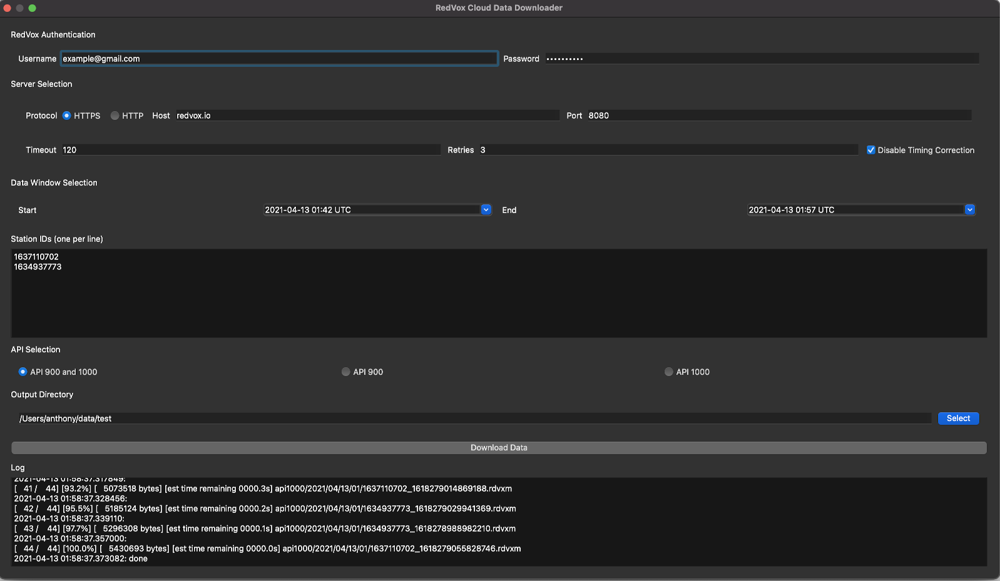

#  **RedVox Python SDK Command Line Interface Manual**

The RedVox SDK includes a Command Line Interface (CLI) for viewing/manipulating local RedVox data and for accessing RedVox Cloud services.

Accessing RedVox Cloud services through the SDK requires a Premium subscription.

## Table of Contents

<!-- toc -->

- [Command Line Interface (CLI)](#command-line-interface-cli)
  * [cloud-download Command Details](#cloud-download-command-details)
  * [data-req Command Details](#data-req-command-details)
  * [data-req-report Command Details](#data-req-report-command-details)
  * [gallery Command Details](#gallery-command-details)
  * [json-to-rdvxm Command Details](#json-to-rdvxm-command-details)
  * [json-to-rdvxz Command Details](#json-to-rdvxz-command-details)
  * [print-m Command Details](#print-m-command-details)
  * [print-z Command Details](#print-z-command-details)
  * [rdvxm-to-json Command Details](#rdvxm-to-json-command-details)
  * [rdvxm-to-rdvxz Command Details](#rdvxm-to-rdvxz-command-details)
  * [rdvxz-to-json Command Details](#rdvxz-to-json-command-details)
  * [rdvxz-to-rdvxm Command Details](#rdvxz-to-rdvxm-command-details)
  * [validate-m Command Details](#validate-m-command-details)

<!-- tocstop -->

## Command Line Interface (CLI)

The RedVox SDK includes a command line interface (CLI) that is installed when the SDK is installed. The name of the CLI is `redvox-cli`.

It's possible to see a list of all commands by running:

```
$ redvox-cli --help
usage: redvox-cli [-h] [--verbose] {gallery,rdvxz-to-rdvxm,rdvxm-to-rdvxz,rdvxz-to-json,rdvxm-to-json,json-to-rdvxz,json-to-rdvxm,sort-unstructured,print-z,print-m,validate-m,data-req,data-req-report} ...

Command line tools for viewing, converting, and downloading RedVox data.

positional arguments:
  {gallery,rdvxz-to-rdvxm,rdvxm-to-rdvxz,rdvxz-to-json,rdvxm-to-json,json-to-rdvxz,json-to-rdvxm,sort-unstructured,print-z,print-m,validate-m,data-req,data-req-report}
    rdvxz-to-rdvxm      Convert rdvxz (API 900) to rdvxm (API 1000/M) files
    rdvxm-to-rdvxz      Convert rdvxm (API 1000/M) to rdvxz (API 900) files
    rdvxz-to-json       Convert rdvxz files to json files
    rdvxm-to-json       Convert rdvxm files to json files
    json-to-rdvxz       Convert json files to rdvxz files
    json-to-rdvxm       Convert json files to rdvxm files
    sort-unstructured   Sorts unstructured RedVox files into their structured counterpart
    print-z             Print contents of rdvxz files to stdout
    print-m             Print contents of rdvxm files to stdout
    validate-m          Validate the structure of API M files
    data-req            Requests a range of RedVox data from RedVox servers
    data-req-report     Request aggregated report data from RedVox servers

optional arguments:
  -h, --help            show this help message and exit
  --verbose, -v         Enable verbose logging
```

Individual help for a specific command can be found by specifying the command and appending `--help`. As an example

```
$ redvox-cli data-req --help
```

_[Table of Contents](#table-of-contents)_

### cloud-download Command Details

The `cloud-download` command can be provided to open a GUI that makes it easy to request and download data from the RedVox Cloud.

This feature requires a RedVox Premium Subscription. 

This feature is only provided when the SDK is installed with the `GUI` extra (i.e. `pip install "redvox[GUI]" --upgrade`)

When ran, you should see a GUI appear with options.



The username and password accept authentication information created when registering an account on redvox.io.

The host and port should not be changed unless you are connecting to a custom server. The timeout can be set up to an hour for long running requests. Retries can be set up to 10.

The start and end time windows are in UTC. Station IDs should be listed one per line. The output directory where the data is downloaded to can be customized otherwise the current working directory is used. When `Download Data` is clicked, a request is made to the server. There may be a slight pause between when the request is made and when data begins to download. You may follow the download progress in the log at the bottom of the GUI. 

The username, password, and server settings can be optionally preloaded by storing these settings in your environment: https://github.com/RedVoxInc/redvox-python-sdk/tree/master/docs/python_sdk/cloud#authenticating-with-redvox-cloud-services


### data-req Command Details

Allows both API 900 and API 1000 data to be requested from the RedVox cloud services. All positional arguments are required and are used to authenticate against the RedVox services as well as to provide a means of specifying which data should be queried.

Every request requires authentication information, a time window, and one or more API 900 or API 1000 station IDs. We recommend storing authentication information in a globally accessible configuration file or through environment variables. This is described in the RedVox Cloud Services documentation at: https://github.com/RedVoxInc/redvox-python-sdk/blob/master/docs/python_sdk/cloud

Downloaded data will be stored according to the structured directory layouts for both API 900 and API 1000. Data is stored in the current working directory unless `--out-dir` is specified.

The time window (specified by `req_start_s` and `req_end_s`) are represented as timestamps as integer number of seconds since the Unix epoch.

It is possible to specify API 900, API 1000, or both (default) by providing the `--api-type` option.

The rest of the optional parameters can be used to specify alternative servers.

_Usage_:

```
$ redvox-cli data-req --help
usage: redvox-cli data-req [-h] [--email EMAIL] [--password PASSWORD] [--out-dir OUT_DIR] [--disable-timing-correction] [--retries {0,1,2,3,4,5}] [--host HOST] [--port PORT] [--protocol {https,http}] [--secret-token SECRET_TOKEN]
                           [--api-type {API_900,API_1000,API_900_1000}] [--timeout TIMEOUT]
                           req_start_s req_end_s station_ids [station_ids ...]

positional arguments:
  req_start_s           Data request start as number of seconds since the epoch UTC
  req_end_s             Data request end as number of seconds since the epoch UTC
  station_ids           A list of RedVox ids delimited by a space

optional arguments:
  -h, --help            show this help message and exit
  --email EMAIL         redvox.io account email
  --password PASSWORD   redvox.io account password
  --out-dir OUT_DIR     The output directory that RedVox files will be written to (default=.)
  --disable-timing-correction
                        Disables query timing correction
  --retries {0,1,2,3,4,5}
                        The number of times the client should retry getting a file on failure (default=1)
  --host HOST           Data server host
  --port PORT           Data server port
  --protocol {https,http}
                        One of either http or https
  --secret-token SECRET_TOKEN
                        A shared secret token provided by RedVox required for accessing the data request service
  --api-type {API_900,API_1000,API_900_1000}
                        Data API to be retrieved
  --timeout TIMEOUT     Read timeout in seconds (default=10 seconds)
```

_Examples_:

Download one hour (2020-12-21 00:00 to 01:00 UTC) of data for a single station (1637681016). Once the download starts, a progress bar will be displayed to stdout:

```
$ redvox-cli data-req --email $USERNAME \ 
  --password $PASSWORD 1608508800 1608512400 1637681016 
[   88 /    88] [100.0%] [   8172067 bytes] 
 [est time remaining 0000.0s] 
 api900/2020/12/21/1637681016_1608512389005.rdvxz(redvox) 
```

Download one hour of data for multiple stations:

```
$ redvox-cli data-req --email $USERNAME \
 --password $PASSWORD 1608508800 1608512400 1637681016 1637620010 1637610002
```

Download only API 900 data:

```
$ redvox-cli data-req --api-type API_900 --email $USERNAME --password $PASSWORD 1608508800 1608512400 1637681016 \
  1637620010 1637610002
```

Download only API 1000 data:

```
$ redvox-cli data-req --api-type API_1000 --email $USERNAME --password $PASSWORD 1608508800 1608512400 1637681016 \
 1637620010 1637610002
```

Download data to an alternate directory:

```
$ redvox-cli data-req --out-dir /data/downloaded --email $USERNAME --password $PASSWORD 1608508800 1608512400 1637681016 
```

Download data with authentication information supplied by the system and without timing correction.

```
$ redvox-cli data-req --out-dir /data/downloaded --disable-timing-correction 1608508800 1608512400 1637681016 
```

_[Table of Contents](#table-of-contents)_

### data-req-report Command Details

This command can be used to download report data that was generated on redvox.io. The downloaded data will be stored in a .zip folder in the current working directory unless `--out-dir` is specified. Downloaded contents include API 900 data files, plots, and other related products.

All positional arguments are required.

In the following example, `$USERNAME` and `$PASSWORD` will be used as placeholders. These should be substituted with valid values in order to run.

The report ID for each redvox.io report can be found both in the URL bar:


and in the report itself:


_Usage_:

```
$ redvox-cli data-req-report --help
usage: redvox-cli data-req-report [-h] [--out-dir OUT_DIR] [--email EMAIL] [--password PASSWORD] [--retries {0,1,2,3,4,5}] [--host HOST] [--port PORT] [--protocol {https,http}] [--secret-token SECRET_TOKEN] report_id

positional arguments:
  report_id             The full report id that data is being requested for

optional arguments:
  -h, --help            show this help message and exit
  --out-dir OUT_DIR     The output directory that RedVox files will be written to (default=.)
  --email EMAIL         redvox.io account email
  --password PASSWORD   redvox.io account password
  --retries {0,1,2,3,4,5}
                        The number of times the client should retry getting a file on failure (default=1)
  --host HOST           Data server host
  --port PORT           Data server port
  --protocol {https,http}
                        One of either http or https (default https)
  --secret-token SECRET_TOKEN
                        A shared secret token provided by RedVox required for accessing the data request service
```

Please note that `--email` and `--password` are only required if you don't store authentication information on your system: https://github.com/RedVoxInc/redvox-python-sdk/blob/master/docs/python_sdk/cloud

_Examples_:

Download data from a report.

```
$ redvox-cli data-req-report --email $USERNAME \
  --password $PASSWORD 24902e9ace824ca3985e60519a9081a4
```

Download data from a report and store in a separate repository.

```
$ redvox-cli data-req-report --out-dir /data/reports --email $USERNAME --password $PASSWORD 24902e9ace824ca3985e60519a9081a4
```

The remaining optional arguments (`--retries`, `--host`, `--port`, `--protocol`) can be used to specify alternate servers for data collection.

_[Table of Contents](#table-of-contents)_

### gallery Command Details

Display an image gallery from images collected from API M data files.


_Usage_:

```
usage: redvox-cli gallery [-h] rdvxm_paths [rdvxm_paths ...]

positional arguments:
  rdvxm_paths  One or more rdvxm files

optional arguments:
  -h, --help   show this help message and exit
```

_Examples_:

Display a gallery from images collected in a single API M file

`redvox-cli gallery 1637680002_1601059713321926.rdvxm`

Display a gallery from images collected in multiple API M files

```shell
redvox-cli gallery 1637680002_1601059713321926.rdvxm \
 637680002_1601059721001962.rdvxm`
````

Display a gallery from images collected from files from the same station

`redvox-cli gallery 1637680002*.rdvxm`

Display a gallery from images collected from all API M files in a directory

`redvox-cli gallery *.rdvxm`

_[Table of Contents](#table-of-contents)_

### json-to-rdvxm Command Details

Converts JSON into API M files. This method does not convert between API versions and will only convert API M JSON that matches the API M specification. Converted files are stored in the same directory unless `--out-dir` is specified.

_Usage_:

```
usage: redvox-cli json-to-rdvxm [-h] [--out-dir OUT_DIR]
 json_paths [json_paths ...]

positional arguments:
  json_paths            One or more json files to convert to rdvxm 
                         files

optional arguments:
  -h, --help            show this help message and exit
  --out-dir OUT_DIR, -o OUT_DIR
                        Optional output directory (will use same 
                         directory as source files by default)
```

_Examples_:

Convert a single file:

`redvox-cli json-to-rdvxm 1637610011_1608074552126819.json`

Convert multiple files:

```shell
redvox-cli json-to-rdvxm 1637610011_1608074552126819.json \
 1637610012_1608074552126900.json
```

Convert multiple files from one device:

`redvox-cli json-to-rdvxm 1637610011*.json`

Convert all JSON files in a directory:

`redvox-cli json-to-rdvxm *.json`

Convert all JSON files in a directory and store converted files in a different directory:

`redvox-cli json-to-rdvxm --out-dir /data/converted *.json`

_[Table of Contents](#table-of-contents)_

### json-to-rdvxz Command Details

Converts JSON into API 900 files. This method does not convert between API versions and will only convert API 900 JSON that matches the API 900 specification. Converted files are stored in the same directory unless `--out-dir` is specified.

_Usage_:

```
usage: redvox-cli json-to-rdvxz [-h] [--out-dir OUT_DIR]
 json_paths [json_paths ...]

positional arguments:
  json_paths            One or more json files to convert to rdvxz
                         files

optional arguments:
  -h, --help            show this help message and exit
  --out-dir OUT_DIR, -o OUT_DIR
                        Optional output directory (will use same 
                         directory as source files by default)
```

_Examples_:


Convert a single file:

`redvox-cli json-to-rdvxz 1637165004_1605402548121.json`

Convert multiple files:

```shell
redvox-cli json-to-rdvxz 1637165004_1605402548121.json \
 1637165006_1605402548122.json
```

Convert multiple files from one device:

`redvox-cli json-to-rdvxz 1637165004*.json`

Convert all JSON files in a directory.

`redvox-cli json-to-rdvxz *.json`

Convert all JSON files in a directory and store converted files in a different directory:

`redvox-cli json-to-rdvxz --out-dir /data/converted *.json`

_[Table of Contents](#table-of-contents)_

### print-m Command Details

Prints the contents of API M files to the standard output (stdout).
The files are first converted to JSON before being displayed to stdout.

_Usage_:

```
usage: redvox-cli print-m [-h] rdvxm_paths [rdvxm_paths ...]

positional arguments:
  rdvxm_paths  One or more rdvxm files to print

optional arguments:
  -h, --help   show this help message and exit
```

_Examples_:

Display a single file:

`redvox-cli print-m 1637610011_1608074552126819.rdvxm`

Display multiple files:

```
redvox-cli print-m 1637610011_1608074552126819.rdvxm \
 1637610012_1608074552126900.rdvxm
```

Display multiple files from one device:

`redvox-cli print-m 1637610011*.rdvxz`

Display all API 900 files in a directory.

`redvox-cli print-m *.rdvxz`

The resulting output should start similar to:

```json
{
  "api": 1000.0,
  "subApi": 9.0,
  "stationInformation": {
    "id": "1637680002",
    "uuid": "1898161379",
    "make": "samsung",
    "model": "SM-G950U",
    "os": "ANDROID",
    "osVersion": "9",
    "appVersion": "3.1.8b",
    "appSettings": {
      "audioSamplingRate": "HZ_800",
      "samplesPerWindow": 2048.0,
      "audioSourceTuning": "INFRASOUND_TUNING",
      "additionalInputSensors": [
        "ACCELEROMETER",
        "LOCATION"
      ],
      "stationId": "1637680002",
      "pushToServer": true,
      "timeSyncServerUrl": "ws://",
      "dataServerUrl": "ws://",
      "authServerUrl": "https://",
      "autoDeleteDataFiles": true,
      "storageSpaceAllowance": 4.0,
      "useLocationServices": true,
      "automaticallyRecord": false,
      "launchAtPowerUp": false,
      "stationDescription": "",
      "publishDataAsPrivate": false,
      ...
```

_[Table of Contents](#table-of-contents)_

### print-z Command Details

Prints the contents of API 900 files to the standard output (stdout).
The files are first converted to JSON before being displayed to stdout.

_Usage_:

```
usage: redvox-cli print-z [-h] rdvxz_paths [rdvxz_paths ...]

positional arguments:
  rdvxz_paths  One or more rdvxz files to print

optional arguments:
  -h, --help   show this help message and exit
```

_Examples_:

Display a single file:

`redvox-cli print-z 1637165004_1605402548121.rdvxz`

Display multiple files:

```
redvox-cli print-z 1637165004_1605402548121.rdvxz \
 1637165006_1605402548122.rdvxz
```

Display multiple files from one device:

`redvox-cli print-z 1637165004*.rdvxz`

Display all API 900 files in a directory.

`redvox-cli print-z *.rdvxz`

Example output will look start similar to:

```
api: 900
uuid: "745340532"
redvox_id: "1637620004"
authenticated_email: "redvoxcore@gmail.com"
authentication_token: "redacted--1918065464"
is_private: true
device_make: "samsung"
device_model: "SM-G981U1"
device_os: "Android"
device_os_version: "10"
app_version: "2.6.20"
acquisition_server: "wss://redvox.io/acquisition/v900"
time_synchronization_server: "wss://redvox.io/synch/v2"
authentication_server: "https://redvox.io/login/mobile"
app_file_start_timestamp_epoch_microseconds_utc: 1605405574053350
app_file_start_timestamp_machine: 1605405574053544
server_timestamp_epoch_microseconds_utc: 1605405613211000
evenly_sampled_channels {
  channel_types: MICROPHONE
  sensor_name: "I/INTERNAL MIC"
  sample_rate_hz: 800.0
  first_sample_timestamp_epoch_microseconds_utc: 1605405574053544
  int32_payload {
    payload: -1369
    payload: -1598
    payload: -3127
    payload: -2785
    payload: 648
    payload: 3509
    payload: 3062
    payload: 3171
    payload: 2901
    payload: 4540
    payload: 5798
    ...
```

### rdvxm-to-json Command Details

Converts API M files into JSON. Converted files are placed in the same directory unless `--out-dir` is specified.

_Usage_:

```
usage: redvox-cli rdvxm-to-json [-h] [--out-dir OUT_DIR]
 rdvxm_paths [rdvxm_paths ...]

positional arguments:
  rdvxm_paths           One or more rdvxm files to convert to json
                         files

optional arguments:
  -h, --help            show this help message and exit
  --out-dir OUT_DIR, -o OUT_DIR
                        Optional output directory (will use same 
                         directory as source files by default)
```

_Examples_:

Convert a single file:

`redvox-cli rdvxm-to-json 1637610011_1608074552126819.rdvxm`

Convert multiple files:

```
redvox-cli rdvxm-to-json 1637610011_1608074552126819.rdvxm \
 1637610012_1608074552126900.rdvxm
```

Convert multiple files from one device:

`redvox-cli rdvxm-to-json 1637610011*.rdvxm`

Convert all API M files in a directory.

`redvox-cli rdvxm-to-json *.rdvxm`

Convert all API M files in a directory and store converted files in a different directory:

`redvox-cli rdvxm-to-json --out-dir /data/converted *.rdvxm`

The start of a converted file should look similar to:

```json
{
  "api": 1000.0,
  "subApi": 9.0,
  "stationInformation": {
    "id": "2553",
    "uuid": "1057189077",
    "authId": "redvoxcore@gmail.com",
    "make": "Google",
    "model": "Pixel 4 XL",
    "os": "ANDROID",
    "osVersion": "11",
    "appVersion": "3.1.12b",
    "isPrivate": true,
    "appSettings": {
      "audioSamplingRate": "HZ_80",
      "samplesPerWindow": 4096.0,
      "audioSourceTuning": "INFRASOUND_TUNING",
      "additionalInputSensors": [
        "GRAVITY",
        "ACCELEROMETER"
      ],
      "automaticallyRecord": true,
      "stationId": "2553",
      "pushToServer": true,
      "publishDataAsPrivate": true,
      "provideBackfill": true,
      "timeSyncServerUrl": "ws://",
      "dataServerUrl": "ws://",
      "authServerUrl": "https://",
      "autoDeleteDataFiles": true,
      "storageSpaceAllowance": 4.0,
      "useLocationServices": true,
      "launchAtPowerUp": false,
      "stationDescription": "",
      ...
```

_[Table of Contents](#table-of-contents)_

### rdvxm-to-rdvxz Command Details

Convert API M files to API 900 files. This is a lossy conversion since API 900 can not store many of the fields present in API M. Data is stored in the untyped API 900 metadata when feasible.

Converted files will be placed in the same directory unless `--out-dir` is specified.

__Note: This method is experimental and in development.__

_Usage_:

```
usage: redvox-cli rdvxm-to-rdvxz [-h] [--out-dir OUT_DIR]
 rdvxm_paths [rdvxm_paths ...]

positional arguments:
  rdvxm_paths           One or more rdvxm files to convert to json
                         files

optional arguments:
  -h, --help            show this help message and exit
  --out-dir OUT_DIR, -o OUT_DIR
                        Optional output directory (will use same
                         directory as source files by default)
```

_Examples_:

Convert a single file:

`redvox-cli rdvxm-to-rdvxz 1637610011_1608074552126819.rdvxm`

Convert multiple files:

```
redvox-cli rdvxm-to-rdvxz 1637610011_1608074552126819.rdvxm \
 1637610012_1608074552126900.rdvxm
```

Convert multiple files from one device:

`redvox-cli rdvxm-to-rdvxz 1637610011*.rdvxm`

Convert all API M files in a directory.

`redvox-cli rdvxm-to-rdvxz *.rdvxm`

Convert all API M files in a directory and store converted files in a different directory:

`redvox-cli rdvxm-to-rdvxz --out-dir /data/converted *.rdvxm`

_[Table of Contents](#table-of-contents)_

### rdvxz-to-json Command Details

Converts API 900 data into JSON. Converted files will be placed in the same directory unless `--out-dir` is specified.

_Usage_:

```
usage: redvox-cli rdvxz-to-json [-h] [--out-dir OUT_DIR]\
 rdvxz_paths [rdvxz_paths ...]

positional arguments:
  rdvxz_paths           One or more rdvxz files to convert to json
                         files

optional arguments:
  -h, --help            show this help message and exit
  --out-dir OUT_DIR, -o OUT_DIR
                        Optional output directory (will use same
                         directory as source files by default)
```

_Examples_:

Convert a single file:

`redvox-cli rdvxz-to-json 1637165004_1605402548121.rdvxz`

Convert multiple files:

```
redvox-cli rdvxz-to-json 1637165004_1605402548121.rdvxz \
 1637165006_1605402548122.rdvxz
```

Convert multiple files from one device:

`redvox-cli rdvxz-to-json 1637165004*.rdvxz`

Convert all API 900 files in a directory.

`redvox-cli rdvxz-to-json *.rdvxz`

Convert all API 900 files in a directory and store converted files in a different directory:

`redvox-cli rdvxz-to-json --out-dir /data/json *.rdvxz`

The start of the converted JSON should look similar to:

```json
{
  "api": 900,
  "uuid": "745340532",
  "redvoxId": "1637620004",
  "authenticatedEmail": "redvoxcore@gmail.com",
  "authenticationToken": "redacted--1918065464",
  "isPrivate": true,
  "deviceMake": "samsung",
  "deviceModel": "SM-G981U1",
  "deviceOs": "Android",
  "deviceOsVersion": "10",
  "appVersion": "2.6.20",
  "acquisitionServer": "wss://redvox.io/acquisition/v900",
  "timeSynchronizationServer": "wss://redvox.io/synch/v2",
  "authenticationServer": "https://redvox.io/login/mobile",
  "appFileStartTimestampEpochMicrosecondsUtc": "1605405574053350",
  "appFileStartTimestampMachine": "1605405574053544",
  "serverTimestampEpochMicrosecondsUtc": "1605405613211000",
  "evenlySampledChannels": [
    {
      "channelTypes": [
        "MICROPHONE"
      ],
      "sensorName": "I/INTERNAL MIC",
      "sampleRateHz": 800.0,
      "firstSampleTimestampEpochMicrosecondsUtc": "1605405574053544",
      "int32Payload": {
        "payload": [
          -1369,
          -1598,
          ...
```

_[Table of Contents](#table-of-contents)_

### rdvxz-to-rdvxm Command Details

Convert API 900 data into API M data. By default, converted files are placed in the same directory with an updated filename that uses the extension `.rdvxm`. A separate output directory may be used by passing the `--out-dir` option.

__Note: This conversion routine is experimental and is work in progress.__

_Usage_:

```text
usage: redvox-cli rdvxz-to-rdvxm [-h] [--out-dir OUT_DIR]
 rdvxz_paths [rdvxz_paths ...]

positional arguments:
  rdvxz_paths           One or more rdvxz files to convert to json 
                         files

optional arguments:
  -h, --help            show this help message and exit
  --out-dir OUT_DIR, -o OUT_DIR
                        Optional output directory (will use same 
                         directory as source files by default)
```

_Examples_:

Convert a single file:

`redvox-cli rdvxz-to-rdvxm 1637165004_1605402548121.rdvxz`

Convert multiple files:

```
redvox-cli rdvxz-to-rdvxm 1637165004_1605402548121.rdvxz \
 1637165006_1605402548122.rdvxz
```

Convert multiple files from one device:

`redvox-cli rdvxz-to-rdvxm 1637165004*.rdvxz`

Convert all API 900 files in a directory.

`redvox-cli rdvxz-to-rdvxm *.rdvxz`

Convert all API 900 files in a directory and store converted files in a different directory:

`redvox-cli rdvxz-to-rdvxm --out-dir /data/converted *.rdvxz`

_[Table of Contents](#table-of-contents)_

### validate-m Command Details

Validates API-M data by ensuring constraints are met. If provided API M files successfully validate, no errors will be reported. If there are validation errors, they will be printed to stdout.

_Usage_:

```
usage: redvox-cli validate-m [-h] rdvxm_paths [rdvxm_paths ...]

positional arguments:
  rdvxm_paths  One or more rdvxm files to print

optional arguments:
  -h, --help   show this help message and exit
```

_Examples_:

Validate a single file:

`$ redvox-cli validate-m 1637610011_1608074552126819.rdvxm`

Validate multiple files:

```
$ redvox-cli validate-m 1637610011_1608074552126819.rdvxm \
 1637610029_1608074136168067.rdvxm`
```

Validate multiple files from a single device:

`$ redvox-cli validate-m 1637610011*.rdvxm`

Validate all API-M files in a directory:

`$ redvox-cli validate-m *.rdvxm`

_[Table of Contents](#table-of-contents)_
