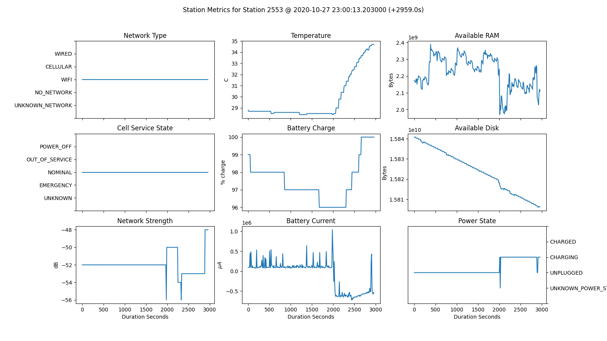
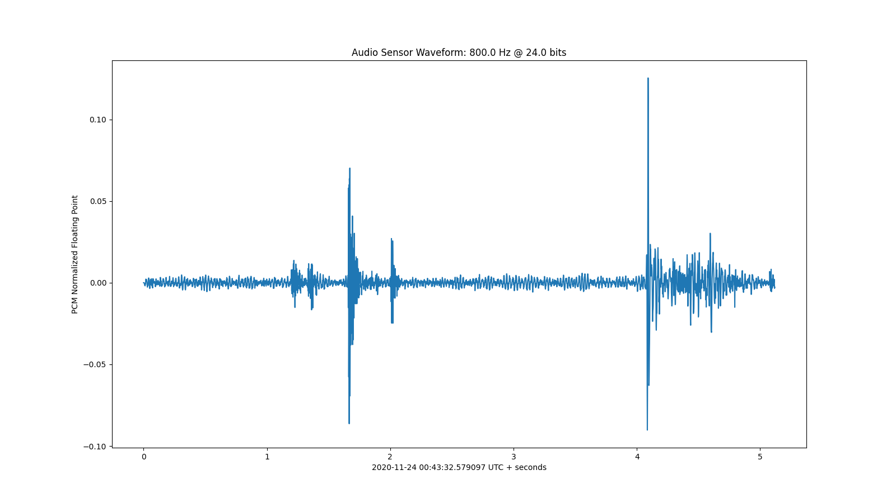
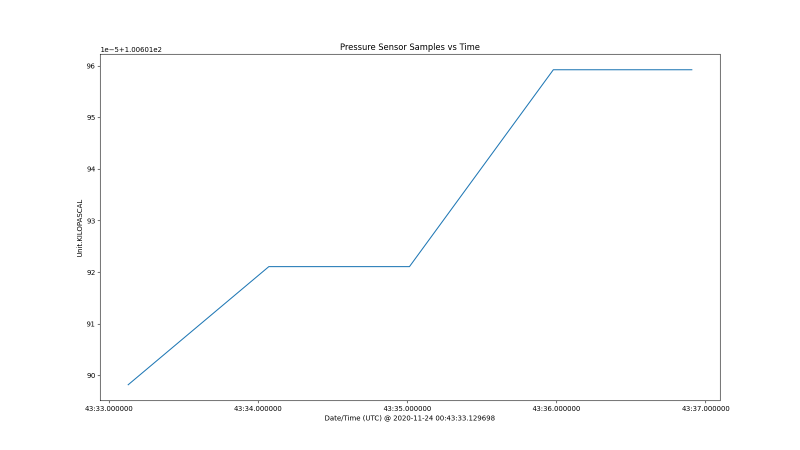
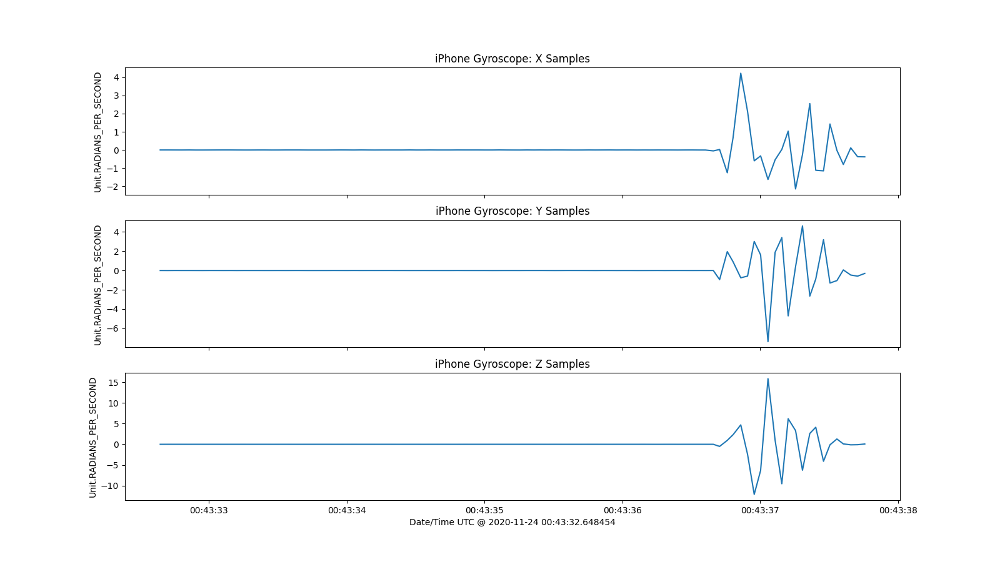

#  **RedVox Python SDK Manual: Low Level API**

The SDK provides a lower level API as well as direct access to the underlying protobuf API. These methods do not provide any type of data conditions or correction and exists only for reading and writing raw RedVox data.

## Table of Contents

<!-- toc -->

- [SDK Low-Level API and Usage](#sdk-low-level-api-and-usage)
  * [Index Class](#index-class)
    + [Reading data from the file system](#reading-data-from-the-file-system)
    + [Streaming data from the file system](#streaming-data-from-the-file-system)
    + [Selectively filtering data](#selectively-filtering-data)
  * [The WrappedRedvoxPacketM Type](#the-wrappedredvoxpacketm-type)
  * [Working with Station Information](#working-with-station-information)
  * [Working with App Settings](#working-with-app-settings)
  * [Working with TimingPayloads, SamplePayloads, and ProtoRepeatedMessages](#working-with-timingpayloads-samplepayloads-and-protorepeatedmessages)
    + [TimingPayload](#timingpayload)
    + [SamplePayload](#samplepayload)
    + [SummaryStatistics](#summarystatistics)
    + [ProtoRepeatedMessage](#protorepeatedmessage)
  * [Working with Station Metrics](#working-with-station-metrics)
  * [Working with Timing Information](#working-with-timing-information)
  * [Working with Sensors](#working-with-sensors)
  * [Working with the Audio Sensor](#working-with-the-audio-sensor)
  * [Working with Other Single Channel Sensors](#working-with-other-single-channel-sensors)
  * [Working with Three Channel Sensors](#working-with-three-channel-sensors)
  * [Working with the Location Sensor](#working-with-the-location-sensor)
    + [Working with the BestLocation type](#working-with-the-bestlocation-type)
- [Tweaking SDK Settings](#tweaking-sdk-settings)
  * [Enabling and Disabling Parallelism](#enabling-and-disabling-parallelism)

<!-- tocstop -->

## SDK Low-Level API and Usage
### Index Class

The [Index](https://redvoxinc.github.io/redvox-sdk/api_docs/redvox/common/io.html#redvox.common.io.Index) class is used 
for reading or streaming API M ".rdvxm" files from disk or byte streams.

_[Table of Contents](#table-of-contents)_

#### Reading data from the file system

API M files can be stored to the file system using two schemes:

1. `Unstructured`: All API M files exist in the same directory.
2. `Structured`: API M files are organized by date and time as specified in the [API-M repo](https://github.com/RedVoxInc/redvox-api-1000/blob/master/docs/standards/filenames_and_directory_structures.md#standard-directory-structure).

The Python SDK provides support for both with the [index_structured](https://redvoxinc.github.io/redvox-sdk/api_docs/redvox/common/io.html#redvox.common.io.index_structured) and [index_unstructured](https://redvoxinc.github.io/redvox-sdk/api_docs/redvox/common/io.html#redvox.common.io.index_unstructured) methods.

These methods skim the directory specified to create an index of files to read.

You can then read the files directly into memory using the index's [read_raw](https://redvoxinc.github.io/redvox-sdk/api_docs/redvox/common/io.html#redvox.common.io.Index.read_raw) 
or [read](https://redvoxinc.github.io/redvox-sdk/api_docs/redvox/common/io.html#redvox.common.io.Index.read) method. 
The `read_raw` method uses the low-level representation, while `read` uses [WrappedRedvoxPacketM](https://redvoxinc.github.io/redvox-sdk/api_docs/redvox/api1000/wrapped_redvox_packet/wrapped_packet.html#redvox.api1000.wrapped_redvox_packet.wrapped_packet.WrappedRedvoxPacketM) 
objects, which will be explained later in the manual. 
While these methods make it convenient to work with the data, they can consume large amounts of memory for large data sets. If this is a concern, consider the streaming alternatives described later in this manual.

Read unstructured data:

```python
import redvox.common.io as rdvx_io

read_index: rdvx_io.Index = rdvx_io.index_unstructured("/data/unstructured")
for ind in read_index.read_raw():
    # operate on low-level packet representation
    print(ind.station_information.id)
```

Read structured data:

```python
import redvox.common.io as rdvx_io

read_index: rdvx_io.Index = rdvx_io.index_structured("/data/structured/api1000")
for ind in read_index.read():
    # operate on mid-level packet representation
    print(ind.redvox_id())
```

_[Table of Contents](#table-of-contents)_

#### Streaming data from the file system

When working with large data sets, the `index.read` and `index.read_raw` methods may consume large amounts of memory. 
[stream](https://redvoxinc.github.io/redvox-sdk/api_docs/redvox/common/io.html#redvox.common.io.Index.stream) and
[stream_raw](https://redvoxinc.github.io/redvox-sdk/api_docs/redvox/common/io.html#redvox.common.io.Index.stream_raw)
provide lazy streaming alternatives.

The `stream` method lazily loads and iterates over a single [WrappedRedvoxPacketM](https://redvoxinc.github.io/redvox-sdk/api_docs/redvox/api1000/wrapped_redvox_packet/wrapped_packet.html#redvox.api1000.wrapped_redvox_packet.wrapped_packet.WrappedRedvoxPacketM) 
at a time.  The `stream_raw` method does the same but over single low-level representations. While this is memory 
efficient, it is up to the programmer to implement their own aggregation and analysis logic on top of this iterator.

Iterating over unstructured data:

```python
from typing import Iterator, TYPE_CHECKING

import redvox.common.io as rdvx_io

if TYPE_CHECKING:
    from redvox.api1000.wrapped_redvox_packet.wrapped_packet import WrappedRedvoxPacketM

index = rdvx_io.index_unstructured("/data/unstructured")
unstructured_iterator: Iterator['WrappedRedvoxPacketM'] = index.stream()

packet: 'WrappedRedvoxPacketM'
for packet in unstructured_iterator:
  # iterating over mid-level representations
  print(packet.default_filename())
```

which produces output similar to:

```
1637610017_1608073990605758.rdvxm
1637610017_1608073988045751.rdvxm
1637610017_1608074005965757.rdvxm
1637610017_1608073975245765.rdvxm
1637610017_1608073993165733.rdvxm
1637610017_1608073982925755.rdvxm
1637610017_1608073998285756.rdvxm
1637610017_1608073980365739.rdvxm
1637610017_1608074000845760.rdvxm
1637610017_1608073977805764.rdvxm
1637610017_1608073995725769.rdvxm
1637610017_1608074008525772.rdvxm
1637610017_1608073985485743.rdvxm
1637610017_1608074003405740.rdvxm
```

Iterating over structured data:

```python
from typing import Iterator, TYPE_CHECKING

import redvox.common.io as rdvx_io

if TYPE_CHECKING:
    from redvox.api1000.proto.redvox_api_m_pb2 import RedvoxPacketM

index = rdvx_io.index_structured("/data/structured/api1000")
structured_iterator: Iterator['RedvoxPacketM'] = index.stream_raw()

packet: 'RedvoxPacketM'
for packet in structured_iterator:
  # iterating over low-level representations
  print(f"{packet.get_station_information().get_id():0>10}_{round(packet.get_timing_information().get_packet_start_mach_timestamp())}.rdvxm")
  # you may notice that it takes a little more code to get the same information as the mid-level function call above.
```

which produces output similar to:

```
1637610015_1608679161651390.rdvxm
1637610015_1608680697651378.rdvxm
1637610019_1608679426724729.rdvxm
1637610019_1608678282404751.rdvxm
1637610019_1608681280164753.rdvxm
...
```

_[Table of Contents](#table-of-contents)_

#### Selectively filtering data

Up to this point, we've only looked at examples of reading entire directories.
All of the `io.read*` and `index.stream*` methods accept a second
optional [ReadFilter](https://redvoxinc.github.io/redvox-sdk/api_docs/redvox/common/io.html#redvox.common.io.ReadFilter)
argument which can be used to select (filter) which files that are read by timestamp, station ID,
or file extension.

`ReadFilter`s can be created using two methods. Filters can be specified in the constructor or by using the builder 
pattern. The following filters are provided:

| Filter | Type | Description |
|--------|------|-------------|
| start_dt | datetime | If specified, read packets that are recorded after the start date/time |
| end_dt | datetime | If specified, read packets that are recorded before the end date/time |
| extension | str | If specified, read packets that match the specified file extension |
| station_ids | Set[str] | If provided, read packets that belong to the provided set of stations |

Let's look at some different filters created using both approaches.

```python
from datetime import datetime

import redvox.common.io as rdvx_io


read_filter: rdvx_io.ReadFilter

# Filter for packets after Dec 1 2020
read_filter = rdvx_io.ReadFilter(start_dt=datetime(2020, 12, 1))
# or
read_filter = rdvx_io.ReadFilter().with_start_dt(datetime(2020, 12, 1))
# or
read_filter = rdvx_io.ReadFilter().with_start_ts(1606780800)

# Filter for packets before Dec 2 2020
read_filter = rdvx_io.ReadFilter(end_dt=datetime(2020, 12, 2))
# or
read_filter = rdvx_io.ReadFilter().with_end_dt(datetime(2020, 12, 2))
# or
read_filter = rdvx_io.ReadFilter().with_end_ts(1606867200)

# Bound packets by a specific time window between Dec 1 to Dec 2 2020
read_filter = rdvx_io.ReadFilter(start_dt=datetime(2020, 12, 1), end_dt=datetime(2020, 12, 2))
# or
read_filter = rdvx_io.ReadFilter().with_start_dt(datetime(2020, 12, 1)).with_end_dt(datetime(2020, 12, 2))
# or
read_filter = rdvx_io.ReadFilter().with_start_ts(1606780800).with_end_ts(1606867200)

# Only load specific station IDs
read_filter = rdvx_io.ReadFilter(station_ids={"0000000001", "0000000002"})
# or
read_filter = rdvx_io.ReadFilter().with_station_ids({"0000000001", "0000000002"})

# It's common to combine these all into a single filter
read_filter = rdvx_io.ReadFilter(start_dt=datetime(2020, 12, 1),
                                 end_dt=datetime(2020, 12, 2),
                                 station_ids={"0000000001", "0000000002"})
# or
read_filter = rdvx_io.ReadFilter() \
  .with_start_dt(datetime(2020, 12, 1)) \
  .with_end_dt(datetime(2020, 12, 2)) \
  .with_station_ids({"0000000001", "0000000002"})

# Once the filter is created, you can pass it directly to one of the read or stream methods. As an example:
read_res: rdvx_io.Index = rdvx_io.index_unstructured("/data/unstructured")
read_raw = read_res.read_raw(read_filter)
stream = read_res.stream(read_filter)
```

_[Table of Contents](#table-of-contents)_

### The WrappedRedvoxPacketM Type

When data is read by the mid-level API, [WrappedRedvoxPacketM](https://redvoxinc.github.io/redvox-sdk/api_docs/redvox/api1000/wrapped_redvox_packet/wrapped_packet.html#redvox.api1000.wrapped_redvox_packet.wrapped_packet.WrappedRedvoxPacketM) 
objects are returned.

This type encapsulates the underlying protobuf and provides a mid-level interface for accessing and setting the 
underlying protobuf data in a semi type-safe way. All API M data for a single packet is accessible through this type.

The following sections will describe the `WrappedRedvoxPacketM` in detail.

_[Table of Contents](#table-of-contents)_

### Working with Station Information

The [StationInformation](https://redvoxinc.github.io/redvox-sdk/api_docs/redvox/api1000/wrapped_redvox_packet/station_information.html#redvox.api1000.wrapped_redvox_packet.station_information.StationInformation) 
encapsulates the station state, a copy of the station's AppSettings, and a collection of `StationMetrics`.

The `StationInformation` can be retrieved by calling [get_station_information](https://redvoxinc.github.io/redvox-sdk/api_docs/redvox/api1000/wrapped_redvox_packet/wrapped_packet.html#redvox.api1000.wrapped_redvox_packet.wrapped_packet.WrappedRedvoxPacketM.get_station_information) 
 on an instance of a `WrappedRedvoxPacketM`.

To get a quick idea about what resides in a `StationInformation`, let's retrieve one and print it out which will print 
out the JSON representation of the `StationInformation`.

```python
from typing import TYPE_CHECKING

from redvox.api1000.wrapped_redvox_packet.wrapped_packet import WrappedRedvoxPacketM

if TYPE_CHECKING:
    from redvox.api1000.wrapped_redvox_packet.station_information import StationInformation

packet: WrappedRedvoxPacketM = WrappedRedvoxPacketM.from_compressed_path("data/1637610015_1608678009651382.rdvxm")
station_information: 'StationInformation' = packet.get_station_information()
print(station_information)
```

This displays something similar to:

```json
{
  "id": "1637610015",
  "uuid": "1809173354",
  "authId": "redvoxcore@gmail.com",
  "make": "samsung",
  "model": "SM-G973U",
  "os": "ANDROID",
  "osVersion": "10",
  "appVersion": "3.1.16",
  "isPrivate": true,
  "appSettings": {
    "audioSamplingRate": "HZ_80",
    "samplesPerWindow": 1024.0,
    "audioSourceTuning": "INFRASOUND_TUNING",
    "additionalInputSensors": [
      "GYROSCOPE",
      "PRESSURE",
      "MAGNETOMETER",
      "ACCELEROMETER"
    ],
    "automaticallyRecord": true,
    "stationId": "1637610015",
    "pushToServer": true,
    "publishDataAsPrivate": true,
    "provideBackfill": true,
    "timeSyncServerUrl": "wss://milton.soest.hawaii.edu:8000/synch/v3",
    "dataServerUrl": "wss://milton.soest.hawaii.edu:8000/acquisition/v1000",
    "authServerUrl": "https://milton.soest.hawaii.edu:8088/api/v1/auth",
    "autoDeleteDataFiles": true,
    "storageSpaceAllowance": 4294967300.0,
    "useLocationServices": true,
    "launchAtPowerUp": false,
    "stationDescription": "",
    "scrambleAudioData": false,
    "removeSensorDcOffset": false,
    "fftOverlap": "UNKNOWN",
    "useCustomTimeSyncServer": false,
    "useCustomDataServer": false,
    "useCustomAuthServer": false,
    "useSdCardForDataStorage": false,
    "useLatitude": 0.0,
    "useLongitude": 0.0,
    "useAltitude": 0.0,
    "metricsRate": "UNKNOWN",
    "metadata": {}
  },
  "stationMetrics": {
    "timestamps": {
      "unit": "MICROSECONDS_SINCE_UNIX_EPOCH",
      "timestamps": [
        1608678010401000.0
      ],
      "meanSampleRate": 0.0,
      "stdevSampleRate": 0.0,
      "metadata": {}
    },
    "networkType": [
      "CELLULAR"
    ],
    "cellServiceState": [
      "NOMINAL"
    ],
    "networkStrength": {
      "unit": "DECIBEL",
      "values": [
        -2147483600.0
      ],
      "valueStatistics": {
        "count": 1.0,
        "mean": -2147483648.0,
        "min": -2147483648.0,
        "max": -2147483648.0,
        "standardDeviation": 0.0,
        "range": 0.0,
        "metadata": {}
      },
      "metadata": {}
    },
    "temperature": {
      "unit": "DEGREES_CELSIUS",
      "values": [
        25.2
      ],
      "valueStatistics": {
        "count": 1.0,
        "mean": 25.200000762939453,
        "min": 25.200000762939453,
        "max": 25.200000762939453,
        "standardDeviation": 0.0,
        "range": 0.0,
        "metadata": {}
      },
      "metadata": {}
    },
    "battery": {
      "unit": "PERCENTAGE",
      "values": [
        100.0
      ],
      "valueStatistics": {
        "count": 1.0,
        "mean": 100.0,
        "min": 100.0,
        "max": 100.0,
        "standardDeviation": 0.0,
        "range": 0.0,
        "metadata": {}
      },
      "metadata": {}
    },
    "batteryCurrent": {
      "unit": "MICROAMPERES",
      "values": [
        -5.0
      ],
      "valueStatistics": {
        "count": 1.0,
        "mean": -5.0,
        "min": -5.0,
        "max": -5.0,
        "standardDeviation": 0.0,
        "range": 0.0,
        "metadata": {}
      },
      "metadata": {}
    },
    "availableRam": {
      "unit": "BYTE",
      "values": [
        4837294000.0
      ],
      "valueStatistics": {
        "count": 1.0,
        "mean": 4837294080.0,
        "min": 4837294080.0,
        "max": 4837294080.0,
        "standardDeviation": 0.0,
        "range": 0.0,
        "metadata": {}
      },
      "metadata": {}
    },
    "availableDisk": {
      "unit": "BYTE",
      "values": [
        110766800000.0
      ],
      "valueStatistics": {
        "count": 1.0,
        "mean": 110766800896.0,
        "min": 110766800896.0,
        "max": 110766800896.0,
        "standardDeviation": 0.0,
        "range": 0.0,
        "metadata": {}
      },
      "metadata": {}
    },
    "cpuUtilization": {
      "unit": "PERCENTAGE",
      "values": [],
      "metadata": {}
    },
    "powerState": [
      "CHARGED"
    ],
    "screenState": [
      "ON"
    ],
    "screenBrightness": {
      "unit": "PERCENTAGE",
      "values": [
        41.568626
      ],
      "valueStatistics": {
        "count": 1.0,
        "mean": 41.568626403808594,
        "min": 41.568626403808594,
        "max": 41.568626403808594,
        "standardDeviation": 0.0,
        "range": 0.0,
        "metadata": {}
      },
      "metadata": {}
    },
    "wifiWakeLock": [],
    "metadata": {}
  },
  "serviceUrls": {
    "authServer": "https://redvox.io:8080/api/v1/auth",
    "synchServer": "wss://redvox.io/synch/v3",
    "acquisitionServer": "wss://redvox.io/acquisition/v1000",
    "metadata": {}
  },
  "description": "",
  "metadata": {}
}
```

Let's examine some of the top-level fields provided by `StationInformation`.

```python
from typing import TYPE_CHECKING

from redvox.api1000.wrapped_redvox_packet.wrapped_packet import WrappedRedvoxPacketM

if TYPE_CHECKING:
    from redvox.api1000.wrapped_redvox_packet.station_information import ServiceUrls, StationInformation


# Load a single wrapped packet
packet: WrappedRedvoxPacketM = WrappedRedvoxPacketM.from_compressed_path("/data/1637610015_1608678009651382.rdvxm")

# Extract the StationInformation
station_information: 'StationInformation' = packet.get_station_information()
print(f"station ID: {station_information.get_id()}")
print(f"station UUID: {station_information.get_uuid()}")
print(f"station description: {station_information.get_description()}")
print(f"station authentication ID: {station_information.get_auth_id()}")
print(f"station OS: {station_information.get_os()}")
print(f"station OS version: {station_information.get_os_version()}")
print(f"station app version: {station_information.get_app_version()}")
print(f"recording privately?: {station_information.get_is_private()}")

# Extract the embedded service URLs
service_urls: 'ServiceUrls' = station_information.get_service_urls()
print(f"authentication URL: {service_urls.get_auth_server()}")
print(f"acquisition URL: {service_urls.get_acquisition_server()}")
print(f"synch URL: {service_urls.get_synch_server()}")
```

Which provides output that looks similar to:

```
station ID: 1637610015
station UUID: 1809173354
station description: 
station authentication ID: redvoxcore@gmail.com
station OS: OsType.ANDROID
station OS version: 10
station app version: 3.1.16
recording privately?: True
authentication URL: https://redvox.io:8080/api/v1/auth
acquisition URL: wss://redvox.io/acquisition/v1000
synch URL: wss://redvox.io/synch/v3
```

It should be noted that [OsType](https://redvoxinc.github.io/redvox-sdk/api_docs/redvox/api1000/wrapped_redvox_packet/station_information.html#redvox.api1000.wrapped_redvox_packet.station_information.OsType) 
is an [enumeration](https://docs.python.org/3.8/library/enum.html) provided by the SDK. API-M and this SDK provide 
enumerations for any field that can hold a finite number of known values.

We examine the embedded `AppSettings` and `StationMetrics` in the following sections.

_[Table of Contents](#table-of-contents)_

### Working with App Settings

Each API M packet stores a copy of the settings used to configure it. These are stored in an instance of 
[AppSettings](https://redvoxinc.github.io/redvox-sdk/api_docs/redvox/api1000/wrapped_redvox_packet/station_information.html#redvox.api1000.wrapped_redvox_packet.station_information.AppSettings) 
which can be retrieved from an instance of `StationInformation` with [get_app_settings](https://redvoxinc.github.io/redvox-sdk/api_docs/redvox/api1000/wrapped_redvox_packet/station_information.html#redvox.api1000.wrapped_redvox_packet.station_information.StationInformation.get_app_settings).

The following example shows which fields are accessible in the `AppSettings`.

```python
from typing import TYPE_CHECKING

from redvox.api1000.wrapped_redvox_packet.wrapped_packet import WrappedRedvoxPacketM

if TYPE_CHECKING:
    from redvox.api1000.wrapped_redvox_packet.station_information import AppSettings, StationInformation

# Load a single wrapped packet
packet: WrappedRedvoxPacketM = WrappedRedvoxPacketM.from_compressed_path("/data/1637610015_1608678009651382.rdvxm")

# Extract the StationInformation
station_information: 'StationInformation' = packet.get_station_information()
app_settings: AppSettings = station_information.get_app_settings()

# Audio Settings
print(f"SR: {app_settings.get_audio_sampling_rate()}")
print(f"samples/window: {app_settings.get_samples_per_window()}")
print(f"audio tuning: {app_settings.get_audio_source_tuning()}")
print(f"FFT overlap: {app_settings.get_fft_overlap()}")

# Additional specified input sensors
print(f"additional sensors: {app_settings.get_additional_input_sensors()}")

# Startup behavior
print(f"automatically record?: {app_settings.get_automatically_record()}")
print(f"launch app at power up?: {app_settings.get_launch_at_power_up()}")

# Station ID
print(f"ID: {app_settings.get_station_id()}")
print(f"description: {app_settings.get_station_description()}")

# Data transmission
print(f"push data to server?: {app_settings.get_push_to_server()}")
print(f"publish data as private?: {app_settings.get_publish_data_as_private()}")
print(f"scramble audio data?: {app_settings.get_scramble_audio_data()}")
print(f"enable data backfill?: {app_settings.get_provide_backfill()}")

# DC Offset
print(f"remove sensor DC offset?: {app_settings.get_remove_sensor_dc_offset()}")

# Custom URLs
print(f"use custom time synch server?: {app_settings.get_use_custom_time_sync_server()}")
print(f"custom time synch URL: {app_settings.get_time_sync_server_url()}")
print(f"use custom authentication server?: {app_settings.get_use_custom_auth_server()}")
print(f"custom authentication URL: {app_settings.get_auth_server_url()}")
print(f"use custom acquisition server?: {app_settings.get_use_custom_data_server()}")
print(f"custom acquisition URL: {app_settings.get_data_server_url()}")

# Custom location
print(f"use location services?: {app_settings.get_use_location_services()}")
print(f"use latitude: {app_settings.get_use_latitude()}")
print(f"use longitude: {app_settings.get_use_longitude()}")
print(f"use altitude: {app_settings.get_use_altitude()}")

# Data management
print(f"auto delete data files?: {app_settings.get_auto_delete_data_files()}")
print(f"storage space allowance: {app_settings.get_storage_space_allowance()}")
print(f"use SD card for storage?: {app_settings.get_use_sd_card_for_data_storage()}")

# Metric rate
print(f"metric collection rate: {app_settings.get_metrics_rate()}")
```

which produces something similar to:

```
SR: AudioSamplingRate.HZ_80
samples/window: 1024.0
audio tuning: AudioSourceTuning.INFRASOUND_TUNING
FFT overlap: FftOverlap.UNKNOWN
additional sensors: [7, 17, 14, 1]
automatically record?: True
launch app at power up?: False
ID: 1637610015
description: 
push data to server?: True
publish data as private?: True
scramble audio data?: False
enable data backfill?: True
remove sensor DC offset?: False
use custom time synch server?: False
custom time synch URL: wss://milton.soest.hawaii.edu:8000/synch/v3
use custom authentication server?: False
custom authentication URL:
 https://milton.soest.hawaii.edu:8088/api/v1/auth
use custom acquisition server?: False
custom acquisition URL:
 wss://milton.soest.hawaii.edu:8000/acquisition/v1000
use location services?: True
use latitude: 0.0
use longitude: 0.0
use altitude: 0.0
auto delete data files?: True
storage space allowance: 4294967296.0
use SD card for storage?: False
metric collection rate: MetricsRate.ONCE_PER_PACKET
```

In the next section, we will examine the final embedded type of `StationInformation`, the `StationMetrics`.

_[Table of Contents](#table-of-contents)_

### Working with TimingPayloads, SamplePayloads, and ProtoRepeatedMessages

Associated API M timestamps and sample payloads are encapsulated by the [TimingPayload](https://redvoxinc.github.io/redvox-sdk/api_docs/redvox/api1000/common/common.html#redvox.api1000.common.common.TimingPayload)
and [SamplePayload](https://redvoxinc.github.io/redvox-sdk/api_docs/redvox/api1000/common/common.html#redvox.api1000.common.common.SamplePayload) 
types. Each of these types also contain a [SummaryStatistics](https://redvoxinc.github.io/redvox-sdk/api_docs/redvox/api1000/common/common.html#redvox.api1000.common.common.SummaryStatistics) 
type which provide descriptive statistics either over the timestamps or the samples.

The timestamps and samples themselves are returned as [numpy ndarrays](https://numpy.org/doc/stable/reference/generated/numpy.ndarray.html).

These types are used within the `StationMetrics` as well as the individual sensor types.

_[Table of Contents](#table-of-contents)_

#### TimingPayload

Let's look at an example of a `TimingPayload` from a pressure sensor.

```python
from typing import Optional, TYPE_CHECKING

from redvox.api1000.wrapped_redvox_packet.wrapped_packet import WrappedRedvoxPacketM

if TYPE_CHECKING:
    from redvox.api1000.common.common import TimingPayload
    from redvox.api1000.wrapped_redvox_packet.sensors.sensors import Sensors
    from redvox.api1000.wrapped_redvox_packet.sensors.single import Single

# Load a single wrapped packet
packet: WrappedRedvoxPacketM = WrappedRedvoxPacketM.from_compressed_path(
  "/data/1637610015_1608678009651382.rdvxm")
sensors: 'Sensors' = packet.get_sensors()
pressure_sensor: Optional['Single'] = sensors.get_pressure()
if pressure_sensor is not None:
  timing_payload: 'TimingPayload' = pressure_sensor.get_timestamps()
  print(f"timing unit: {timing_payload.get_unit()}")
  print(f"# timestamps: {timing_payload.get_timestamps_count()}")
  print(f"mean sample rate: {timing_payload.get_mean_sample_rate()}")
  print(f"stddev sample rate: {timing_payload.get_stdev_sample_rate()}")
  print(f"timestamps: {timing_payload.get_timestamps()}")
```

which produces output similar to:

```
timing unit: Unit.MICROSECONDS_SINCE_UNIX_EPOCH
# timestamps: 320
mean sample rate: 2.5037625164259225e-05
stddev sample rate: 9.869223731584498e-07
timestamps: 
[1.60867801e+15 1.60867801e+15 1.60867801e+15 1.60867801e+15
 1.60867801e+15 1.60867801e+15 1.60867801e+15 1.60867801e+15
 1.60867801e+15 1.60867801e+15 1.60867801e+15 1.60867801e+15
 1.60867801e+15 1.60867801e+15 1.60867801e+15 1.60867801e+15
 1.60867801e+15 1.60867801e+15 1.60867801e+15 1.60867801e+15
 ...
 1.60867802e+15 1.60867802e+15 1.60867802e+15 1.60867802e+15
 1.60867802e+15 1.60867802e+15 1.60867802e+15 1.60867802e+15
 1.60867802e+15 1.60867802e+15 1.60867802e+15 1.60867802e+15
 1.60867802e+15 1.60867802e+15 1.60867802e+15 1.60867802e+15]
```

_[Table of Contents](#table-of-contents)_

#### SamplePayload

`SamplePayload`s are quite similar. Let's examine the samples from a pressure sensor.

```python
from typing import Optional, TYPE_CHECKING

from redvox.api1000.wrapped_redvox_packet.wrapped_packet import WrappedRedvoxPacketM

# Load a single wrapped packet
packet: WrappedRedvoxPacketM = WrappedRedvoxPacketM.from_compressed_path(
  "/data/1637610015_1608678009651382.rdvxm")
sensors: 'Sensors' = packet.get_sensors()
pressure_sensor: Optional['Single'] = sensors.get_pressure()
if pressure_sensor is not None:
  sample_payload: 'SamplePayload' = pressure_sensor.get_samples()
  print(f"sample unit: {sample_payload.get_unit()}")
  print(f"sample count: {sample_payload.get_values_count()}")
  print(f"samples: {sample_payload.get_values()}")
```

which produces output similar to:

```
sample unit: Unit.KILOPASCAL
sample count: 320
samples: 
[101.58366394 101.58217621 101.58532715 101.58430481 101.58498383
 101.5843277  101.58345032 101.58901215 101.58503723 101.58276367
 101.58322906 101.58818054 101.58850098 101.58442688 101.58567047
 101.58351898 101.58276367 101.58374023 101.58381653 101.5851593
 101.58418274 101.58237457 101.5851059  101.59004211 101.58498383
 101.58335114 101.5847168  101.5843277  101.58532715 101.58498383
 ...
 101.58388519 101.58296204 101.58280945 101.58461761 101.58247375
 101.5867691  101.58259583 101.58081055 101.58488464 101.58293152
 101.58713531 101.5839386  101.5867157  101.58476257 101.58339691
 101.58598328 101.58290863 101.58283997 101.58357239 101.58369446]
```

_[Table of Contents](#table-of-contents)_

#### SummaryStatistics

Every `TimingPayload` and every `SamplePayload` has an associated 
[SummaryStatistics](https://redvoxinc.github.io/redvox-sdk/api_docs/redvox/api1000/common/common.html#redvox.api1000.common.common.SummaryStatistics) sub-type.

Let's look at example summary statistics calculated over the samples of a pressure sensor.

```python
from typing import Optional, TYPE_CHECKING

from redvox.api1000.wrapped_redvox_packet.wrapped_packet import WrappedRedvoxPacketM

if TYPE_CHECKING:
    from redvox.api1000.common.common import SamplePayload, SummaryStatistics
    from redvox.api1000.wrapped_redvox_packet.sensors.sensors import Sensors
    from redvox.api1000.wrapped_redvox_packet.sensors.single import Single

    # Load a single wrapped packet
    packet: WrappedRedvoxPacketM = WrappedRedvoxPacketM.from_compressed_path(
      "/data/1637610015_1608678009651382.rdvxm")
    sensors: 'Sensors' = packet.get_sensors()
    pressure_sensor: Optional['Single'] = sensors.get_pressure()
    if pressure_sensor is not None:
      sample_payload: 'SamplePayload' = pressure_sensor.get_samples()
      summary_statistics: 'SummaryStatistics' = sample_payload.get_summary_statistics()
      print(f"count: {summary_statistics.get_count()}")
      print(f"min: {summary_statistics.get_min()}")
      print(f"max: {summary_statistics.get_max()}")
      print(f"range: {summary_statistics.get_range()}")
      print(f"mean: {summary_statistics.get_mean()}")
      print(f"stddev: {summary_statistics.get_standard_deviation()}")
```

_[Table of Contents](#table-of-contents)_

#### ProtoRepeatedMessage

Finally, protobuf has the concept of [repeated fields](https://developers.google.com/protocol-buffers/docs/proto3#specifying_field_rules). 
This SDK provides a special wrapper type [ProtoRepeatedMessage](https://redvoxinc.github.io/redvox-sdk/api_docs/redvox/api1000/common/generic.html#redvox.api1000.common.generic.ProtoRepeatedMessage) 
that makes working with underlying repeated fields easier. Any getter that returns a list of items that can't be 
represented by a numpy ndarray is represented by a `ProtoRepeatedMessage`.

Calling [get_values](https://redvoxinc.github.io/redvox-sdk/api_docs/redvox/api1000/common/generic.html#redvox.api1000.common.generic.ProtoRepeatedMessage.get_values) 
on a `ProtoRepeatedMessage` will convert the contents into a list of those items.

An example of this is accessing the additional sensors from the `AppSettings`.

```python
from typing import TYPE_CHECKING

from redvox.api1000.wrapped_redvox_packet.wrapped_packet import WrappedRedvoxPacketM

if TYPE_CHECKING:
    from redvox.api1000.common.generic import ProtoRepeatedMessage
    from redvox.api1000.wrapped_redvox_packet.station_information import StationInformation, AppSettings

# Load a single wrapped packet
packet: WrappedRedvoxPacketM = WrappedRedvoxPacketM.from_compressed_path("/data/1637610015_1608678009651382.rdvxm")
station_information: 'StationInformation' = packet.get_station_information()
app_settings: 'AppSettings' = station_information.get_app_settings()
additional_sensors: 'ProtoRepeatedMessage' = app_settings.get_additional_input_sensors()

print(f"additional sensors counts: {additional_sensors.get_count()}")
for additional_sensor in additional_sensors.get_values():
  print(additional_sensor)
```

which produces output similar to:

```
additional sensors counts: 4
InputSensor.GYROSCOPE
InputSensor.PRESSURE
InputSensor.MAGNETOMETER
InputSensor.ACCELEROMETER
```

_[Table of Contents](#table-of-contents)_

### Working with Station Metrics

[StationMetrics](https://redvoxinc.github.io/redvox-sdk/api_docs/redvox/api1000/wrapped_redvox_packet/station_information.html#redvox.api1000.wrapped_redvox_packet.station_information.StationMetrics) 
contains timeseries information providing health and status metrics associated with the station. These include 
computational metrics such as CPU, RAM, and disk usage as well as information on power consumption, network state, 
temperature, and screen state.

There is a single [TimingPayload](https://redvoxinc.github.io/redvox-sdk/api_docs/redvox/api1000/common/common.html#redvox.api1000.common.common.TimingPayload) 
that contains timestamps. Every metric index corresponds to the timestamp at the same index. If a given metric is not 
available, `nan` is used to represent that particular sample.

Currently, metrics are either captured once per second or once per packet.

The following is an example of a packet with metrics captured once per packet:

```python
from typing import TYPE_CHECKING

from redvox.api1000.wrapped_redvox_packet.wrapped_packet import WrappedRedvoxPacketM

if TYPE_CHECKING:
    from redvox.api1000.common.common import TimingPayload, SamplePayload
    from redvox.api1000.common.generic import ProtoRepeatedMessage
    from redvox.api1000.wrapped_redvox_packet.station_information import StationInformation, StationMetrics


# Load a single wrapped packet
packet: WrappedRedvoxPacketM = WrappedRedvoxPacketM.from_compressed_path("/data/1637610015_1608678009651382.rdvxm")
station_information: 'StationInformation' = packet.get_station_information()
station_metrics: 'StationMetrics' = station_information.get_station_metrics()

metric_timestamps: 'TimingPayload' = station_metrics.get_timestamps()
print(f"metric timestamps: {metric_timestamps.get_timestamps()}")

network_type: 'ProtoRepeatedMessage' = station_metrics.get_network_type()
print(f"network type: {network_type.get_values()}")

cell_service_state: 'ProtoRepeatedMessage' = station_metrics.get_cell_service_state()
print(f"cell service state: {cell_service_state.get_values()}")

network_strength: 'SamplePayload' = station_metrics.get_network_strength()
print(f"network strength {network_strength.get_unit()}: {network_strength.get_values()}")

temperature: 'SamplePayload' = station_metrics.get_temperature()
print(f"temperature {temperature.get_unit()}: {temperature.get_values()}")

battery: 'SamplePayload' = station_metrics.get_battery()
print(f"battery {battery.get_unit()}: {battery.get_values()}")

battery_current: 'SamplePayload' = station_metrics.get_battery_current()
print(f"battery_current {battery_current.get_unit()}: {battery_current.get_values()}")

available_ram: 'SamplePayload' = station_metrics.get_available_ram()
print(f"available_ram {available_ram.get_unit()}: {available_ram.get_values()}")

available_disk: 'SamplePayload' = station_metrics.get_available_disk()
print(f"available_disk {available_disk.get_unit()}: {available_disk.get_values()}")

cpu_utilization: 'SamplePayload' = station_metrics.get_cpu_utilization()
print(f"cpu utilization {cpu_utilization.get_unit()}: {cpu_utilization.get_values()}")

power_state: 'ProtoRepeatedMessage' = station_metrics.get_power_state()
print(f"power state {power_state}")

wifi_wake_lock: 'ProtoRepeatedMessage' = station_metrics.get_wifi_wake_loc()
print(f"wifi_wake_lock {wifi_wake_lock}")

screen_state: 'ProtoRepeatedMessage' = station_metrics.get_screen_state()
print(f"screen_state {screen_state}")

screen_brightness: 'SamplePayload' = station_metrics.get_screen_brightness()
print(f"screen_brightness {screen_brightness.get_unit()}: {screen_brightness.get_values()}")
```

This produces output similar to:

```
metric timestamps: [1.60867801e+15]
network type: [<NetworkType.CELLULAR: 3>]
cell service state: [<CellServiceState.NOMINAL: 2>]
network strength Unit.DECIBEL: [-2.14748365e+09]
temperature Unit.DEGREES_CELSIUS: [25.20000076]
battery Unit.PERCENTAGE: [100.]
battery_current Unit.MICROAMPERES: [-5.]
available_ram Unit.BYTE: [4.83729408e+09]
available_disk Unit.BYTE: [1.10766801e+11]
cpu utilization Unit.PERCENTAGE: [nan]
power state [3]
wifi_wake_lock [0]
screen_state [1]
screen_brightness Unit.PERCENTAGE: [41.5686264]
```

The following example extracts and plots the station metrics:

```python
from datetime import datetime
from typing import List, TYPE_CHECKING, Tuple

# noinspection Mypy
import matplotlib.pyplot as plt
# noinspection Mypy
import numpy as np

# noinspection Mypy
import redvox.common.io as rdvx_io
# noinspection Mypy
from redvox.api1000.wrapped_redvox_packet.station_information import CellServiceState, NetworkType, PowerState

# noinspection Mypy
if TYPE_CHECKING:
    from enum import Enum
    from redvox.api1000.wrapped_redvox_packet.wrapped_packet import WrappedRedvoxPacketM
    from redvox.api1000.wrapped_redvox_packet.station_information import StationMetrics


# noinspection PyTypeChecker,Mypy
def yticks_for_enum(enum: 'Enum') -> Tuple[List[int], List[str]]:
    """
    Given an API M enumeration, convert the variants into a list of Y-indcices and the associated label.
    :param enum: The enumeration to prep for the y-axis.
    :return: A tuple containing a list of y-indices and a list of labels.
    """
    ticks: List[int] = list(map(lambda e: e.value, enum))
    tick_labels: List[str] = list(map(lambda e: e.name, enum))

    # Pad the ends
    ticks.insert(0, ticks[0] - 1)
    ticks.append(ticks[-1] + 1)
    tick_labels.insert(0, "")
    tick_labels.append("")

    return ticks, tick_labels


# Load the data
path: str = "/data/api_m"
res: rdvx_io.Index = rdvx_io.index_unstructured(path)
packets: List['WrappedRedvoxPacketM'] = res.get_index_for_station_id("2553").read()

# Prepare to aggregate metrics
ts: np.ndarray = np.array([])
network_type: List[str] = []
cell_service_states: List[str] = []
network_strength: np.ndarray = np.array([])
temperature: np.ndarray = np.ndarray([])
battery: np.ndarray = np.ndarray([])
battery_current: np.ndarray = np.ndarray([])
available_ram: np.ndarray = np.ndarray([])
available_disk: np.ndarray = np.ndarray([])
power_state: List[str] = []

# Perform the actual aggregation
for packet in packets:
    metrics: 'StationMetrics' = packet.get_station_information().get_station_metrics()
    ts = np.append(ts, metrics.get_timestamps().get_timestamps())
    network_type.extend(metrics.get_network_type().get_values())
    cell_service_states.extend(metrics.get_cell_service_state().get_values())
    network_strength = np.append(network_strength, metrics.get_network_strength().get_values())
    temperature = np.append(temperature, metrics.get_temperature().get_values())
    battery = np.append(battery, metrics.get_battery().get_values())
    battery_current = np.append(battery_current, metrics.get_battery_current().get_values())
    available_ram = np.append(available_ram, metrics.get_available_ram().get_values())
    available_disk = np.append(available_disk, metrics.get_available_disk().get_values())
    power_state.extend(metrics.get_power_state().get_values())

# Convert timestamps into date/times
dts: List[datetime] = list(map(lambda t: datetime.utcfromtimestamp(t / 1_000_000.0), ts))

# Compute the diffs between consecutive timestamps
diffs: List[int] = [int((t - ts[0]) / 1_000_000.0) for t in ts]

# Setup the plot
fig: plt.Figure
axes: List[List[plt.Axes]]
fig, axes = plt.subplots(3, 3, figsize=(16, 9), sharex="all")

fig.subplots_adjust(hspace=0.2, wspace=0.2)
fig.suptitle(f"Station Metrics for Station 2553 @ {dts[0]} (+{(dts[-1] - dts[0]).total_seconds()}s)")

network_type_ax: plt.Axes = axes[0][0]
network_type_ax.plot(diffs, list(map(lambda nt: nt.value, network_type)))
network_type_ax.set_title("Network Type")
# noinspection PyTypeChecker
(yticks, ylabels) = yticks_for_enum(NetworkType)
network_type_ax.set_yticks(yticks)
network_type_ax.set_yticklabels(ylabels)

cell_service_states_ax: plt.Axes = axes[1][0]
cell_service_states_ax.plot(diffs, list(map(lambda cst: cst.value, cell_service_states)))
cell_service_states_ax.set_title("Cell Service State")
# noinspection PyTypeChecker
(yticks, ylabels) = yticks_for_enum(CellServiceState)
cell_service_states_ax.set_yticks(yticks)
cell_service_states_ax.set_yticklabels(ylabels)

network_strength_ax: plt.Axes = axes[2][0]
network_strength_ax.plot(diffs, network_strength)
network_strength_ax.set_title("Network Strength")
network_strength_ax.set_ylabel("dB")
network_strength_ax.set_xlabel("Duration Seconds")

temperature_ax: plt.Axes = axes[0][1]
temperature_ax.plot(diffs, temperature[1:])
temperature_ax.set_title("Temperature")
temperature_ax.set_ylabel("C")

battery_ax: plt.Axes = axes[1][1]
battery_ax.plot(diffs, battery[1:])
battery_ax.set_title("Battery Charge")
battery_ax.set_ylabel("% charge")

battery_current_ax: plt.Axes = axes[2][1]
battery_current_ax.plot(diffs, battery_current[1:])
battery_current_ax.set_title("Battery Current")
battery_current_ax.set_ylabel("$\mu A$")
battery_current_ax.set_xlabel("Duration Seconds")

available_ram_ax: plt.Axes = axes[0][2]
available_ram_ax.plot(diffs, available_ram[1:])
available_ram_ax.set_title("Available RAM")
available_ram_ax.set_ylabel("Bytes")

available_disk_ax: plt.Axes = axes[1][2]
available_disk_ax.plot(diffs, available_disk[1:])
available_disk_ax.set_title("Available Disk")
available_disk_ax.set_ylabel("Bytes")

power_states_ax: plt.Axes = axes[2][2]
power_states_ax.plot(diffs, list(map(lambda cst: cst.value, power_state)))
power_states_ax.set_title("Power State")
# noinspection PyTypeChecker
(yticks, ylabels) = yticks_for_enum(PowerState)
power_states_ax.set_yticks(yticks)
power_states_ax.set_yticklabels(ylabels)
power_states_ax.yaxis.tick_right()
power_states_ax.set_xlabel("Duration Seconds")

# Save the plot to disk
fig.savefig("/data/metrics.png")
```

The resulting plot is shown below:



_[Table of Contents](#table-of-contents)_

### Working with Timing Information

The [TimingInformation](https://redvoxinc.github.io/redvox-sdk/api_docs/redvox/api1000/wrapped_redvox_packet/timing_information.html#redvox.api1000.wrapped_redvox_packet.timing_information.TimingInformation) 
type contains several types of timestamps as well as metadata describing the quality of the timing. Let's examine the 
contents of the `TimingInformation` type: 

All timestamps are represented as microseconds since the Unix epoch.

| Value | Description |
|-------|-------------|
| packet_start_os_timestamp | Non-monotonic. Corresponds to the first audio sample. |
| packet_end_os_timestamp | Non-monotonic. Corresponds to the last audio sample. |
| packet_start_mach_timestamp | Monotonic. Corresponds to the first audio sample. | 
| packet_end_mach_timestamp | Monotonic. Corresponds to the last audio sample. |
| server_acquisition_arrival_timestamp | Timestamp of acquisition arrival |
| app_start_mach_timestamp | Monotonic. Station started recording. |
| best_latency | Best timing latency from exchanges |
| best_offset | Best timing offset from exchanges |
| score | Score of the timing |
| score_method | How method used to find the timing score |
| synch_exchanges | A list of completed time synchronization exchanges. |


Each [SynchExchange](https://redvoxinc.github.io/redvox-sdk/api_docs/redvox/api1000/wrapped_redvox_packet/timing_information.html#redvox.api1000.wrapped_redvox_packet.timing_information.SynchExchange) 
contains coefficients that represent timings between the station and the time synchronization server.

Let's look at an example:

```python
from typing import TYPE_CHECKING, List

from redvox.api1000.wrapped_redvox_packet.wrapped_packet import WrappedRedvoxPacketM

if TYPE_CHECKING:
  from redvox.api1000.common.generic import ProtoRepeatedMessage
  from redvox.api1000.wrapped_redvox_packet.timing_information import TimingInformation, SynchExchange

# Load a single wrapped packet
packet: WrappedRedvoxPacketM = WrappedRedvoxPacketM.from_compressed_path("/data/1637610015_1608678009651382.rdvxm")
timing_information: TimingInformation = packet.get_timing_information()

print(f"packet os start: {timing_information.get_packet_start_os_timestamp()}")
print(f"packet os end: {timing_information.get_packet_end_os_timestamp()}")
print(f"packet mach start: {timing_information.get_packet_start_mach_timestamp()}")
print(f"packet mach end: {timing_information.get_packet_end_mach_timestamp()}")
print(f"app mach start: {timing_information.get_app_start_mach_timestamp()}")
print(f"server received at: {timing_information.get_server_acquisition_arrival_timestamp()}")
print(f"best latency from exchanges: {timing_information.get_best_latency()}")
print(f"best offset from exchanges: {timing_information.get_best_offset()}")

synch_exchanges_repeated: 'ProtoRepeatedMessage' = timing_information.get_synch_exchanges()
synch_exchanges: List[SynchExchange] = synch_exchanges_repeated.get_values()
synch_exchange: 'SynchExchange'
for i, synch_exchange in enumerate(synch_exchanges):
  print(f"exchange {i + 1} of {len(synch_exchanges)}")
  print(f"\tcoeff a1: {synch_exchange.get_a1()}")
  print(f"\tcoeff a2: {synch_exchange.get_a2()}")
  print(f"\tcoeff a3: {synch_exchange.get_a3()}")
  print(f"\tcoeff b1: {synch_exchange.get_b1()}")
  print(f"\tcoeff b2: {synch_exchange.get_b2()}")
  print(f"\tcoeff b3: {synch_exchange.get_b3()}")
```

which produces output similar to:

```
packet os start: 1608678009651738.0
packet os end: 1608678022439238.0
packet mach start: 1608678009651382.0
packet mach end: 1608678022438882.0
app mach start: 1608236472775000.0
server received at: 1608678019622784.8
best latency from exchanges: 58975.5
best offset from exchanges: -4861737.5
exchange 1 of 12
	coeff a1: 1608678005757478.0
	coeff a2: 1608678006047620.0
	coeff a3: 1608678006047629.0
	coeff b1: 1608678010678569.0
	coeff b2: 1608678010678700.0
	coeff b3: 1608678010970948.0
exchange 2 of 12
	coeff a1: 1608678006569516.0
	coeff a2: 1608678006710435.0
	coeff a3: 1608678006710442.0
	coeff b1: 1608678011507680.0
	coeff b2: 1608678011507831.0
	coeff b3: 1608678011631986.0

...

exchange 12 of 12
	coeff a1: 1608678016591191.0
	coeff a2: 1608678016717009.0
	coeff a3: 1608678016717017.0
	coeff b1: 1608678021513598.0
	coeff b2: 1608678021513819.0
	coeff b3: 1608678021637366.0
```

_[Table of Contents](#table-of-contents)_

### Working with Sensors

Calling [get_sensors](https://redvoxinc.github.io/redvox-sdk/api_docs/redvox/api1000/wrapped_redvox_packet/wrapped_packet.html#redvox.api1000.wrapped_redvox_packet.wrapped_packet.WrappedRedvoxPacketM.get_sensors) 
on an instance of `WrappedRedvoxPacketM` will return a [Sensors](https://redvoxinc.github.io/redvox-sdk/api_docs/redvox/api1000/wrapped_redvox_packet/sensors/sensors.html#redvox.api1000.wrapped_redvox_packet.sensors.sensors.Sensors) 
type. This type provides access to all underlying sensor data within a RedVox API M packet.

The corresponding `has_*` methods return True if a sensor is present of False otherwise. The corresponding `get_*` 
methods return the sensor if it is present or `None`.

Returned sensors are either specialized or generic. Specialized sensors contain layouts or methods that match a specific 
sensor type while generic sensors can contain data from multiple sensor types.

Specialized sensors include [Audio](https://redvoxinc.github.io/redvox-sdk/api_docs/redvox/api1000/wrapped_redvox_packet/sensors/audio.html#redvox.api1000.wrapped_redvox_packet.sensors.audio.Audio), 
[CompressedAudio](https://redvoxinc.github.io/redvox-sdk/api_docs/redvox/api1000/wrapped_redvox_packet/sensors/audio.html#redvox.api1000.wrapped_redvox_packet.sensors.audio.CompressedAudio), 
[Image](https://redvoxinc.github.io/redvox-sdk/api_docs/redvox/api1000/wrapped_redvox_packet/sensors/image.html#redvox.api1000.wrapped_redvox_packet.sensors.image.Image), 
and [Location](https://redvoxinc.github.io/redvox-sdk/api_docs/redvox/api1000/wrapped_redvox_packet/sensors/location.html#redvox.api1000.wrapped_redvox_packet.sensors.location.Location) sensors.

Generic sensors are represented by the types [Single](https://redvoxinc.github.io/redvox-sdk/api_docs/redvox/api1000/wrapped_redvox_packet/sensors/single.html#redvox.api1000.wrapped_redvox_packet.sensors.single.Single) 
(which contains a single channel of timestamped sensor data and includes `ambient_temperature`, `light`, `pressure`, 
`proximity`, and `relative_humidity`) and [XYZ](https://redvoxinc.github.io/redvox-sdk/api_docs/redvox/api1000/wrapped_redvox_packet/sensors/xyz.html#redvox.api1000.wrapped_redvox_packet.sensors.xyz.Xyz) 
(which contains three channels of timestamped sensor data and includes `accelerometer`, `gravity`, `gyroscope`, 
`linear_acceleration`, `magnetometer`, `orientation`, `rotation_vector`, and `velocity`).

It's best practice to retrieve a sensor, and then check that it's not `None` before working with it.

```python
# ...

sensors: 'Sensors' = packet.get_sensors()
audio_sensor: 'Audio' = sensors.get_audio()
if audio_sensor is not None:
    # Do something with the audio sensor
```

The following is a full example:

```python
from typing import TYPE_CHECKING, List, Optional

import redvox.common.io as rdvx_io

if TYPE_CHECKING:
  from redvox.api1000.wrapped_redvox_packet.sensors.audio import Audio, CompressedAudio
  from redvox.api1000.wrapped_redvox_packet.sensors.image import Image
  from redvox.api1000.wrapped_redvox_packet.sensors.location import Location
  from redvox.api1000.wrapped_redvox_packet.sensors.sensors import Sensors
  from redvox.api1000.wrapped_redvox_packet.sensors.single import Single
  from redvox.api1000.wrapped_redvox_packet.sensors.xyz import Xyz
  from redvox.api1000.wrapped_redvox_packet.wrapped_packet import WrappedRedvoxPacketM


# First, read some packets
read_res: rdvx_io.Index = rdvx_io.index_unstructured("/data/ios")
packets: List['WrappedRedvoxPacketM'] = read_res.get_index_for_station_id("3264984082").read()

# Let's examine data from a single packet
packet: 'WrappedRedvoxPacketM' = packets[0]
sensors: 'Sensors' = packet.get_sensors()

print(f"has audio?: {sensors.has_audio()}")
print(f"has compressed audio?: {sensors.has_compress_audio()}")
print(f"has gravity?: {sensors.has_gravity()}")
print(f"has gyroscope?: {sensors.has_gyroscope()}")
print(f"has image?: {sensors.has_image()}")
print(f"has light?: {sensors.has_light()}")
print(f"has lin. accel.?: {sensors.has_linear_acceleration()}")
print(f"has location?: {sensors.has_location()}")
print(f"has magnetometer?: {sensors.has_magnetometer()}")
print(f"has orientation?: {sensors.has_orientation()}")
print(f"has pressure?: {sensors.has_pressure()}")
print(f"has proximity?: {sensors.has_proximity()}")
print(f"has relative humidity?: {sensors.has_relative_humidity()}")
print(f"has rotation vector?: {sensors.has_rotation_vector()}")
print(f"has velocity?: {sensors.has_velocity()}")

audio_sensor: Optional['Audio'] = sensors.get_audio()
if audio_sensor is not None:
  print(f"audio desc: {audio_sensor.get_sensor_description()}")
else:
  print(f"audio DNE")

compressed_audio_sensor: Optional['CompressedAudio'] = sensors.get_compressed_audio()
if compressed_audio_sensor is not None:
  print(f"compressed_audio desc: {compressed_audio_sensor.get_sensor_description()}")
else:
  print(f"compressed_audio DNE")

gravity_sensor: Optional['Xyz'] = sensors.get_gravity()
if gravity_sensor is not None:
  print(f"gravity_sensor desc: {gravity_sensor.get_sensor_description()}")
else:
  print(f"gravity_sensor DNE")

gyroscope_sensor: Optional['Xyz'] = sensors.get_gyroscope()
if gyroscope_sensor is not None:
  print(f"gyroscope_sensor desc: {gyroscope_sensor.get_sensor_description()}")
else:
  print(f"gyroscope_sensor DNE")

image_sensor: Optional['Image'] = sensors.get_image()
if image_sensor is not None:
  print(f"image_sensor desc: {image_sensor.get_sensor_description()}")
else:
  print(f"image_sensor DNE")

light_sensor: Optional['Single'] = sensors.get_light()
if light_sensor is not None:
  print(f"light_sensor desc: {light_sensor.get_sensor_description()}")
else:
  print(f"light_sensor DNE")

linear_acceleration_sensor: Optional['Xyz'] = sensors.get_linear_acceleration()
if linear_acceleration_sensor is not None:
  print(f"linear_acceleration_sensor desc: {linear_acceleration_sensor.get_sensor_description()}")
else:
  print(f"linear_acceleration_sensor DNE")

location_sensor: Optional['Location'] = sensors.get_location()
if location_sensor is not None:
  print(f"location_sensor desc: {location_sensor.get_sensor_description()}")
else:
  print(f"location_sensor DNE")

magnetometer_sensor: Optional['Xyz'] = sensors.get_magnetometer()
if magnetometer_sensor is not None:
  print(f"magnetometer_sensor desc: {magnetometer_sensor.get_sensor_description()}")
else:
  print(f"magnetometer_sensor DNE")

orientation_sensor: Optional['Xyz'] = sensors.get_orientation()
if orientation_sensor is not None:
  print(f"orientation_sensor desc: {orientation_sensor.get_sensor_description()}")
else:
  print(f"orientation_sensor DNE")

pressure_sensor: Optional['Single'] = sensors.get_pressure()
if pressure_sensor is not None:
  print(f"pressure_sensor desc: {pressure_sensor.get_sensor_description()}")
else:
  print(f"pressure_sensor DNE")

proximity_sensor: Optional['Single'] = sensors.get_proximity()
if proximity_sensor is not None:
  print(f"proximity_sensor desc: {proximity_sensor.get_sensor_description()}")
else:
  print(f"proximity_sensor DNE")

relative_humidity_sensor: Optional['Single'] = sensors.get_relative_humidity()
if relative_humidity_sensor is not None:
  print(f"relative_humidity_sensor desc: {relative_humidity_sensor.get_sensor_description()}")
else:
  print(f"relative_humidity_sensor DNE")

rotation_vector_sensor: Optional['Xyz'] = sensors.get_rotation_vector()
if rotation_vector_sensor is not None:
  print(f"rotation_vector_sensor desc: {rotation_vector_sensor.get_sensor_description()}")
else:
  print(f"rotation_vector_sensor DNE")

velocity_sensor: Optional['Xyz'] = sensors.get_velocity()
if velocity_sensor is not None:
  print(f"velocity_sensor desc: {velocity_sensor.get_sensor_description()}")
else:
  print(f"velocity_sensor DNE")
```

which produces output similar to:

```text
has audio?: True
has compressed audio?: False
has gravity?: False
has gyroscope?: True
has image?: True
has light?: False
has lin. accel.?: False
has location?: True
has magnetometer?: False
has orientation?: False
has pressure?: True
has proximity?: False
has relative humidity?: False
has rotation vector?: False
has velocity?: False
audio desc: Internal mic Bottom
compressed_audio DNE
gravity_sensor DNE
gyroscope_sensor desc: iPhone Gyroscope
image_sensor desc: internal camera
light_sensor DNE
linear_acceleration_sensor DNE
location_sensor desc: iPhone location services
magnetometer_sensor DNE
orientation_sensor DNE
pressure_sensor desc: internal barometer
proximity_sensor DNE
relative_humidity_sensor DNE
rotation_vector_sensor DNE
velocity_sensor DNE
```

The following sections will describe both the specialized and generic sensor types in detail.

_[Table of Contents](#table-of-contents)_

### Working with the Audio Sensor

The [Audio](https://redvoxinc.github.io/redvox-sdk/api_docs/redvox/api1000/wrapped_redvox_packet/sensors/audio.html#redvox.api1000.wrapped_redvox_packet.sensors.audio.Audio) 
sensor type encapsulates audio data and metadata.

The `Audio` type provides audio samples through the [get_samples](https://redvoxinc.github.io/redvox-sdk/api_docs/redvox/api1000/wrapped_redvox_packet/sensors/audio.html#redvox.api1000.wrapped_redvox_packet.sensors.audio.Audio.get_samples) 
which returns a `SamplePayload'. The rest of the methods are used for accessing the associated metadata.

Let's look at an example:

```python
from typing import TYPE_CHECKING, List, Optional

import matplotlib.pyplot as plt
import numpy as np
import redvox.common.io as rdvx_io
import redvox.common.date_time_utils as dt_utils

if TYPE_CHECKING:
    from redvox.api1000.wrapped_redvox_packet.wrapped_packet import WrappedRedvoxPacketM
    from redvox.api1000.wrapped_redvox_packet.sensors.sensors import Sensors
    from redvox.api1000.wrapped_redvox_packet.sensors.audio import Audio
    from redvox.api1000.common.common import SamplePayload, SummaryStatistics

    
def plot_audio(audio_sensor: 'Audio') -> None:
    fig: plt.Figure
    ax: plt.Axes
    fig, ax = plt.subplots(1, 1, figsize=(16, 9))

    samples: np.ndarray = audio_sensor.get_samples().get_values()
    delta_t: List[float] = [(1 / audio_sensor.get_sample_rate()) * i for i in range(len(samples))]
    ax.plot(delta_t, samples)

    ax.set_title(
        f"Audio Sensor Waveform: {audio_sensor.get_sample_rate()} Hz @ {audio_sensor.get_bits_of_precision()} bits")
    ax.set_ylabel("PCM Normalized Floating Point")
    first_ts = audio_sensor.get_first_sample_timestamp()
    first_ts_dt = dt_utils.datetime_from_epoch_microseconds_utc(first_ts) 
    ax.set_xlabel(f"{first_ts_dt} UTC + seconds")

    fig.savefig("audio_wf.png")

    
# First, read some packets
read_res: rdvx_io.Index = rdvx_io.index_unstructured("/data/ios")
packets: List['WrappedRedvoxPacketM'] = read_res.get_index_for_station_id("3264984082").read()

# Let's examine the audio data from a single packet
packet: 'WrappedRedvoxPacketM' = packets[0]
sensors: 'Sensors' = packet.get_sensors()
audio_sensor: Optional['Audio'] = sensors.get_audio()

if audio_sensor is not None:
    print(f"sensor description: {audio_sensor.get_sensor_description()}")
    print(f"audio sampling rate: {audio_sensor.get_sample_rate()}, bits: {audio_sensor.get_bits_of_precision()}")
    print(f"first sample timestamp: {audio_sensor.get_first_sample_timestamp()}")
    print(f"audio channel contains {audio_sensor.get_num_samples()} samples")
    print(f"duration timedelta: {audio_sensor.get_duration()}, duration s: {audio_sensor.get_duration_s()}")
    print(f"is scrambled?: {audio_sensor.get_is_scrambled()}")

    # The samples themselves are stored in a `SamplePayload` described in a previous section
    sample_payload: 'SamplePayload' = audio_sensor.get_samples()
    sample_statistics: 'SummaryStatistics' = sample_payload.get_summary_statistics()
    print(f"sample statistics: {sample_statistics}")
    samples: np.ndarray = sample_payload.get_values()

    i: int
    sample: float
    for i, sample in enumerate(samples):
        print(f"sample {i + 1} of {len(samples)} = {sample}")

    plot_audio(audio_sensor)
```

which produces output similar to the following:

```
sensor description: Internal mic Bottom
audio sampling rate: 800.0, bits: 24.0
first sample timestamp: 1606178612579097.0
audio channel contains 4096 samples
duration timedelta: 0:00:05.120000, duration s: 5.12
is scrambled?: False
sample statistics: {
  "count": 4096.0,
  "mean": -1.8745340639725327e-06,
  "standardDeviation": 0.007038324540069889,
  "min": -0.09023404121398926,
  "max": 0.12541162967681885,
  "range": 0.2156456708908081,
  "metadata": {}
}
sample 1 of 4096 = 0.0
sample 2 of 4096 = 0.0
sample 3 of 4096 = 0.0
sample 4 of 4096 = 5.960464477539063e-08
...
sample 4096 of 4096 = -0.002716660499572754
```

and saves a figure that looks like:



_[Table of Contents](#table-of-contents)_

### Working with Other Single Channel Sensors

Sensors with a single channel (such as the pressure sensor) are represented using the 
[Single](https://redvoxinc.github.io/redvox-sdk/api_docs/redvox/api1000/wrapped_redvox_packet/sensors/single.html#redvox.api1000.wrapped_redvox_packet.sensors.single.Single) sensor type.

The `Single` type provides access to the sensor's samples (via the `SamplePayload` type), timestamps (via the 
`TimingPayload` type), and sensor description. Let's look at an example.

```python
from datetime import datetime
from typing import TYPE_CHECKING, List, Optional

import matplotlib.pyplot as plt
import numpy as np
import redvox.common.io as rdvx_io
import redvox.common.date_time_utils as dt_utils

if TYPE_CHECKING:
    from redvox.api1000.wrapped_redvox_packet.wrapped_packet import WrappedRedvoxPacketM
    from redvox.api1000.wrapped_redvox_packet.sensors.sensors import Sensors
    from redvox.api1000.wrapped_redvox_packet.sensors.single import Single


def plot_single(single_sensor: 'Single') -> None:
    fig: plt.Figure
    ax: plt.Axes
    fig, ax = plt.subplots(1, 1, figsize=(16, 9))

    samples: np.ndarray = single_sensor.get_samples().get_values()
    date_times: List[datetime] = list(map(dt_utils.datetime_from_epoch_microseconds_utc,
                                          single_sensor.get_timestamps().get_timestamps()))

    ax.plot(date_times, samples)

    ax.set_title(
        f"Pressure Sensor Samples vs Time")
    ax.set_ylabel(f"{single_sensor.get_samples().get_unit()}")
    ax.set_xlabel(f"Date/Time (UTC) @ {date_times[0]}")

    fig.savefig("pressure_wf.png")


# First, read some packets
read_res: rdvx_io.Index = rdvx_io.index_unstructured("/data/ios")
packets: List['WrappedRedvoxPacketM'] = read_res.get_index_for_station_id("3264984082").read()

# Let's examine the pressure data from a single packet
packet: 'WrappedRedvoxPacketM' = packets[0]
sensors: 'Sensors' = packet.get_sensors()
pressure_sensor: Optional['Single'] = sensors.get_pressure()

if pressure_sensor is not None:
    print(f"sensor description: {pressure_sensor.get_sensor_description()}")
    print(f"num timestamps: {pressure_sensor.get_timestamps().get_timestamps_count()}")
    print(f"num samples: {pressure_sensor.get_samples().get_values_count()}")

    plot_single(pressure_sensor)
```

which produces output similar to:

```text
sensor description: internal barometer
num timestamps: 5
num samples: 5
```

and creates a figure that looks like:



_[Table of Contents](#table-of-contents)_

### Working with Three Channel Sensors

Three channel sensors (such as the gyroscope) are represented by the 
[Xyz](https://redvoxinc.github.io/redvox-sdk/api_docs/redvox/api1000/wrapped_redvox_packet/sensors/xyz.html#redvox.api1000.wrapped_redvox_packet.sensors.xyz.Xyz) 
type. This type encapsulates timestamped data that has X, Y, and Z channels. Like other types, the `Xyz` type provides 
samples as `SamplePayload`s and timestamps as a `TimingPayload`.

Let's look at an example and plot gyroscope data.

```python
from datetime import datetime
from typing import TYPE_CHECKING, List, Optional

import matplotlib.pyplot as plt
import numpy as np
import redvox.common.io as rdvx_io
import redvox.common.date_time_utils as dt_utils

if TYPE_CHECKING:
    from redvox.api1000.wrapped_redvox_packet.wrapped_packet import WrappedRedvoxPacketM
    from redvox.api1000.wrapped_redvox_packet.sensors.sensors import Sensors
    from redvox.api1000.wrapped_redvox_packet.sensors.xyz import Xyz

def plot_xyz(xyz_sensor: 'Xyz') -> None:
    fig: plt.Figure
    axes: List[plt.Axes]
    fig, axes = plt.subplots(3, 1, figsize=(16, 9), sharex="all")

    samples_x: np.ndarray = xyz_sensor.get_x_samples().get_values()
    samples_y: np.ndarray = xyz_sensor.get_y_samples().get_values()
    samples_z: np.ndarray = xyz_sensor.get_z_samples().get_values()
    date_times: List[datetime] = list(map(dt_utils.datetime_from_epoch_microseconds_utc,
                                          xyz_sensor.get_timestamps().get_timestamps()))
    x_ax: plt.Axes = axes[0]
    y_ax: plt.Axes = axes[1]
    z_ax: plt.Axes = axes[2]

    x_ax.plot(date_times, samples_x)
    x_ax.set_title(f"{xyz_sensor.get_sensor_description()}: X Samples")
    x_ax.set_ylabel(f"{xyz_sensor.get_x_samples().get_unit()}")

    y_ax.plot(date_times, samples_y)
    y_ax.set_title(f"{xyz_sensor.get_sensor_description()}: Y Samples")
    y_ax.set_ylabel(f"{xyz_sensor.get_y_samples().get_unit()}")

    z_ax.plot(date_times, samples_z)
    z_ax.set_title(f"{xyz_sensor.get_sensor_description()}: Z Samples")
    z_ax.set_ylabel(f"{xyz_sensor.get_z_samples().get_unit()}")
    z_ax.set_xlabel(f"Date/Time UTC @ {date_times[0]}")

    fig.savefig("gyro_wf.png")

read_res: rdvx_io.Index = rdvx_io.index_unstructured("/data/ios")
packets: List['WrappedRedvoxPacketM'] = read_res.get_index_for_station_id("3264984082").read()
packet: 'WrappedRedvoxPacketM' = packets[0]
sensors: 'Sensors' = packet.get_sensors()
gyroscope_sensor: Optional['Xyz'] = sensors.get_gyroscope()

if gyroscope_sensor is not None:
    print(f"sensor description: {gyroscope_sensor.get_sensor_description()}")
    print(f"num timestamps: {gyroscope_sensor.get_timestamps().get_timestamps_count()}")
    print(f"num X samples: {gyroscope_sensor.get_x_samples().get_values_count()}")
    print(f"num Y samples: {gyroscope_sensor.get_y_samples().get_values_count()}")
    print(f"num Z samples: {gyroscope_sensor.get_z_samples().get_values_count()}")
    plot_xyz(gyroscope_sensor)
```

which produces output similar to:

```text
sensor description: iPhone Gyroscope
num timestamps: 104
num X samples: 104
num Y samples: 104
num Z samples: 104
```

and a plot that looks like:



_[Table of Contents](#table-of-contents)_

### Working with the Location Sensor

The [Location](https://redvoxinc.github.io/redvox-sdk/api_docs/redvox/api1000/wrapped_redvox_packet/sensors/location.html#redvox.api1000.wrapped_redvox_packet.sensors.location.Location) 
type encapsulates location information.

Location samples are stored as `SamplePayload`s and samples can be provided for latitude, longitude, altitude, speed, 
and bearing fields. If a location provider does not provide one of these fields, samples for that field will be set to `nan`s.

Accuracy `SamplePayload`s are also provided for each of the above location fields.

Machine based timestamps are always provided, but when available, GPS timestamps are additionally provided. It should be 
noted that GPS timestamps when provided may be used to correct for machine based timestamps in other sensor channels.

Let's look at some examples of the top-level location data.

```python
from datetime import datetime
from typing import List, Optional, TYPE_CHECKING

import numpy as np
import redvox.common.io as rdvx_io
import redvox.common.date_time_utils as dt_utils

if TYPE_CHECKING:
    from redvox.api1000.wrapped_redvox_packet.sensors.location import Location
    from redvox.api1000.wrapped_redvox_packet.sensors.sensors import Sensors
    from redvox.api1000.wrapped_redvox_packet.wrapped_packet import WrappedRedvoxPacketM

    
read_res: rdvx_io.Index = rdvx_io.index_unstructured("/data/movement")
packets: List['WrappedRedvoxPacketM'] = read_res.get_index_for_station_id("2553").read()
packet: 'WrappedRedvoxPacketM' = packets[0]
sensors: 'Sensors' = packet.get_sensors()
location_sensor: Optional['Location'] = sensors.get_location()

if location_sensor is not None:
    # Extract timestamps and convert them into datetimes for eventual plotting
    timestamps: np.ndarray = location_sensor.get_timestamps().get_timestamps()
    gps_timestamps: np.ndarray = location_sensor.get_timestamps_gps().get_timestamps()
    timestamp_dts: List[datetime] = list(map(dt_utils.datetime_from_epoch_microseconds_utc, timestamps))
    timestamp_gps_dts: List[datetime] = list(map(dt_utils.datetime_from_epoch_microseconds_utc, gps_timestamps))

    # Examine some of the location metadata
    print(f"location sensor: {location_sensor.get_sensor_description()}")
    print(f"location services requested?: {location_sensor.get_location_services_requested()}")
    print(f"location services enabled?: {location_sensor.get_location_services_enabled()}")
    print(f"location permissions granted?: {location_sensor.get_location_permissions_granted()}")
    print(f"total location samples: {len(timestamps)}")
    print(f"contains only metadata?: {location_sensor.is_only_best_values()}")
    print("Location providers")
    i: int = 0
    for location_provider in location_sensor.get_location_providers().get_values():
        print(f"\t{timestamp_gps_dts[i]}: {location_provider}")
        i += 1

    # Location
    print(f"latitudes ({location_sensor.get_latitude_samples().get_unit()}): {location_sensor.get_latitude_samples().get_values()}")
    print(f"longitudes ({location_sensor.get_longitude_samples().get_unit()}): {location_sensor.get_longitude_samples().get_values()}")
    print(f"altitudes ({location_sensor.get_altitude_samples().get_unit()}): {location_sensor.get_altitude_samples().get_values()}")
    print(f"speeds ({location_sensor.get_speed_samples().get_unit()}): {location_sensor.get_speed_samples().get_values()}")
    print(f"bearings ({location_sensor.get_bearing_samples().get_unit()}): {location_sensor.get_bearing_samples().get_values()}")

    # Accuracies
    print(f"vertical accuracies ({location_sensor.get_vertical_accuracy_samples().get_unit()}): {location_sensor.get_vertical_accuracy_samples().get_values()}")
    print(f"horizontal accuracies ({location_sensor.get_horizontal_accuracy_samples().get_unit()}): {location_sensor.get_horizontal_accuracy_samples().get_values()}")
    print(f"bearing accuracies ({location_sensor.get_bearing_accuracy_samples().get_unit()}): {location_sensor.get_bearing_accuracy_samples().get_values()}")
    print(f"speed accuracies ({location_sensor.get_speed_accuracy_samples().get_unit()}): {location_sensor.get_speed_accuracy_samples().get_values()}")
```

which produces output similar to:

```text
location sensor: Location Manager
location services requested?: True
location services enabled?: True
location permissions granted?: True
total location samples: 53
contains only metadata?: False
Location providers
	2020-10-15 23:17:48: LocationProvider.GPS
	2020-10-15 23:17:49: LocationProvider.GPS
	2020-10-15 23:17:50: LocationProvider.GPS
    ...
	2020-10-15 23:18:30: LocationProvider.GPS
	2020-10-15 23:18:33: LocationProvider.GPS
	2020-10-15 23:18:33.192000: LocationProvider.NETWORK
	2020-10-15 23:18:34: LocationProvider.GPS
	2020-10-15 23:18:35: LocationProvider.GPS
    ...
latitudes (Unit.DECIMAL_DEGREES): 
[21.30814566 21.30814279 21.30814147 21.30814159 21.30814154 21.308141
 21.30814165 21.30814165 21.30814171 21.30814173 21.30813982 21.308139
 ...
 21.30814005 21.30814009 21.30814014 21.30814015 21.3081938  21.308140
 21.30814095 21.30814093 21.30814089 21.30814089 21.30814089]
longitudes (Unit.DECIMAL_DEGREES): 
[-157.78778724 -157.78778597 -157.78778674 -157.78778679 -157.78778686
 -157.78778672 -157.7877867  -157.78778665 -157.78778658 -157.78778652
 ...
 -157.78778435 -157.78778428 -157.78778429 -157.78778425 -157.7877842
 -157.78778415 -157.7877882  -157.78778417 -157.78778416 -157.7877842
 -157.78778413 -157.78778414 -157.78778405]
altitudes (Unit.METERS): 
[149.24041748 149.48571777 149.59265137 149.55267334 149.57385254
 149.54504395 149.55249023 149.54290771 149.53082275 149.52526855
 ...
 148.91137695 148.91125488 148.92303467 148.92486572 148.92114258
 148.92926025 151.80000305 148.93261719 148.94189453 148.94995117
 148.95214844 148.95703125 148.94677734]
speeds (Unit.METERS_PER_SECOND): 
[ 0.  0.  0.  0.  0.  0.  0.  0.  0.  0.  0.  0.  0.  0.  0.  0.  0.  0.
  0.  0.  0.  0.  0.  0.  0.  0.  0.  0.  0.  0.  0.  0.  0.  0.  0.  0.
  0.  0.  0.  0.  0.  0.  0.  0.  0.  0. nan  0.  0.  0.  0.  0.  0.]
bearings (Unit.DECIMAL_DEGREES): 
[nan nan nan nan nan nan nan nan nan nan nan nan nan nan nan nan nan nan
 nan nan nan nan nan nan nan nan nan nan nan nan nan nan nan nan nan nan
 nan nan nan nan nan nan nan nan nan nan nan nan nan nan nan nan nan]
vertical accuracies (Unit.METERS): 
[4.04521513 3.94506383 4.12108612 4.2849102  4.35364866 4.13775921
 4.19493008 4.21796322 4.06928349 4.07338953 4.24162626 4.35861778
 ...
 4.44652367 4.61858273 4.58817434 4.58273411 2.         4.7916255
 4.78965235 4.74104977 4.88773489 4.48270416 4.29787683]
horizontal accuracies (Unit.METERS): 
[ 3.79009247  3.79009247  3.79009247  3.79009247  3.79009247  3.790092
  3.79009247  3.79009247  3.84698653  3.99811769  3.89571548  3.952076
  ...
  3.79009247  3.79009247  3.79009247  3.79009247 21.02099991  3.790092
  3.79925203  9.9350462   9.9812851   9.9350462   9.9350462 ]
bearing accuracies (Unit.DECIMAL_DEGREES): 
[nan nan nan nan nan nan nan nan nan nan nan nan nan nan nan nan nan nan
 nan nan nan nan nan nan nan nan nan nan nan nan nan nan nan nan nan nan
 nan nan nan nan nan nan nan nan nan nan nan nan nan nan nan nan nan]
speed accuracies (Unit.METERS_PER_SECOND): 
[0.08602326 0.19209373 0.11401755 0.42201895 0.28319603 0.21931712
 0.26400757 0.24207437 0.28017852 0.43416587 0.21633308 0.14866069
 ...  
 0.2147091  0.31890437 0.34655446 0.2059126         nan 0.49203658
 0.45967379 0.30463094 0.19235384 0.09219544 0.11313708]
```

_[Table of Contents](#table-of-contents)_

#### Working with the BestLocation type

Previous "best" locations can be stored in the packet which represent the best recorded locations (or those with the 
highest accuracy) captured at previous point in time. These are represented using the [BestLocation](https://redvoxinc.github.io/redvox-sdk/api_docs/redvox/api1000/wrapped_redvox_packet/sensors/location.html#redvox.api1000.wrapped_redvox_packet.sensors.location.BestLocation) type.

The `last_best_location` field represents the best location out of a set of locations that was __most recently 
received__. When a station loses its ability to ascertain the location, the `last_best_location` provides the most 
recent location estimate of that station.

The `overall_best_location` field stores the best computed location since the station started recording.

Each `BestLocation` type has fields that represent various location metrics at potentially different points in time. 
For example, the best latitude and longitude have an associated timestamp. The best altitude, the best bearing and the 
best speed each have their own associated timestamp. Associated accuracies and 
scores are set when available.

Timestamps within the `BestLocation` type are represented using the 
[BestTimestamp](https://redvoxinc.github.io/redvox-sdk/api_docs/redvox/api1000/wrapped_redvox_packet/sensors/location.html#redvox.api1000.wrapped_redvox_packet.sensors.location.BestTimestamp) 
type which encapsulates both the mach and GPS times for a particular location metric.

Let's look at an example:

```python
from typing import List, Optional, TYPE_CHECKING

import redvox.common.io as rdvx_io

if TYPE_CHECKING:
    from redvox.api1000.wrapped_redvox_packet.sensors.location import Location, BestLocation
    from redvox.api1000.wrapped_redvox_packet.sensors.sensors import Sensors
    from redvox.api1000.wrapped_redvox_packet.wrapped_packet import WrappedRedvoxPacketM


read_res: rdvx_io.Index = rdvx_io.index_unstructured("/home/opq/data/movement/unstructured")
packets: List['WrappedRedvoxPacketM'] = read_res.get_index_for_station_id("2553").read()
packet: 'WrappedRedvoxPacketM' = packets[0]
sensors: 'Sensors' = packet.get_sensors()
location_sensor: Optional['Location'] = sensors.get_location()

if location_sensor is not None:
    # The most recent best location
    last_best_location: 'BestLocation' = location_sensor.get_last_best_location()

    # The best location since station start
    overall_best_location: 'BestLocation' = location_sensor.get_overall_best_location()
    
    lat_lng_ts = overall_best_location.get_latitude_longitude_timestamp()
    print(f"best location provider: {overall_best_location.get_location_provider()}")
    print(f"best lat/lng={overall_best_location.get_latitude()}/"
          f"{overall_best_location.get_longitude()} @ "
          f"mach={lat_lng_ts.get_mach()}, "
          f"gps={lat_lng_ts.get_gps()}")
    print(f"best altitude={overall_best_location.get_altitude()} @ "
          f"mach={overall_best_location.get_altitude_timestamp().get_mach()}, "
          f"gps={overall_best_location.get_altitude_timestamp().get_gps()}")
    print(f"best speed={overall_best_location.get_speed()} @ "
          f"mach={overall_best_location.get_speed_timestamp().get_mach()}, "
          f"gps={overall_best_location.get_speed_timestamp().get_gps()}")
    print(f"best bearing={overall_best_location.get_bearing()} @ "
          f"mach={overall_best_location.get_bearing_timestamp().get_mach()}, "
          f"gps={overall_best_location.get_bearing_timestamp().get_gps()}")
    print(f"best horizontal_accuracy={overall_best_location.get_horizontal_accuracy()}")
    print(f"best vertical_accuracy={overall_best_location.get_vertical_accuracy()}")
    print(f"best speed_accuracy={overall_best_location.get_speed_accuracy()}")
    print(f"best bearing_accuracy={overall_best_location.get_bearing_accuracy()}")
```

which produces output similar to:

```text
best location provider: LocationProvider.GPS
best lat/lng=21.30814566/-157.78778724 @ mach=1602803867999621.0,
 gps=1602803868000000.0
best altitude=151.8000030517578 @ mach=1602803913192053.0,
 gps=1602803913192000.0
best speed=0.0 @ mach=1602803867999621.0, gps=1602803868000000.0
best bearing=0.0 @ mach=nan, gps=nan
best horizontal_accuracy=3.7900924682617188
best vertical_accuracy=2.0
best speed_accuracy=0.0860232561826706
best bearing_accuracy=0.0
```

_[Table of Contents](#table-of-contents)_

## Tweaking SDK Settings

The SDK now defines globally accessible settings that can be tweaked either through the SDK or by setting environmental variables.

### Enabling and Disabling Parallelism

Where possible, the SDK provides the ability to perform certain tasks concurrently using multiple processes. 
Enabling parallelism is useful for very large data sets, whereas the overhead of parallelism can slow down the processing of small data sets.

By default, parallelism is disabled. It can be enabled either through a global setting or by setting an environmental variable.

To enable parallelism programmatically, see the following example:

```python
import redvox.settings as settings

settings.set_parallelism_enabled(True)
```

To enable or disable parallelism through an environment variable, set the environment variable `REDVOX_ENABLE_PARALLELISM` to either `true` or `false`.
